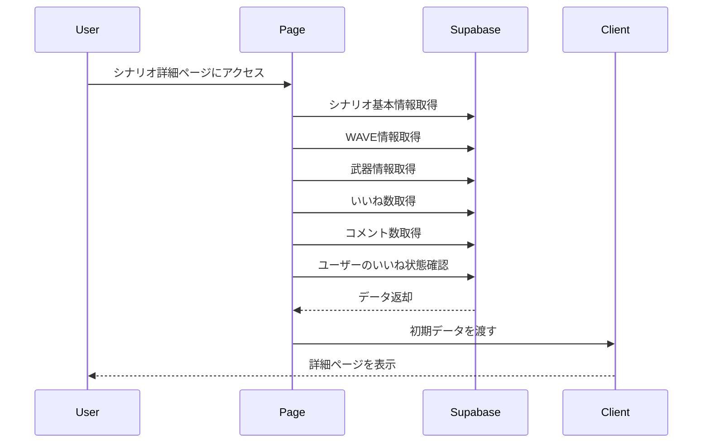
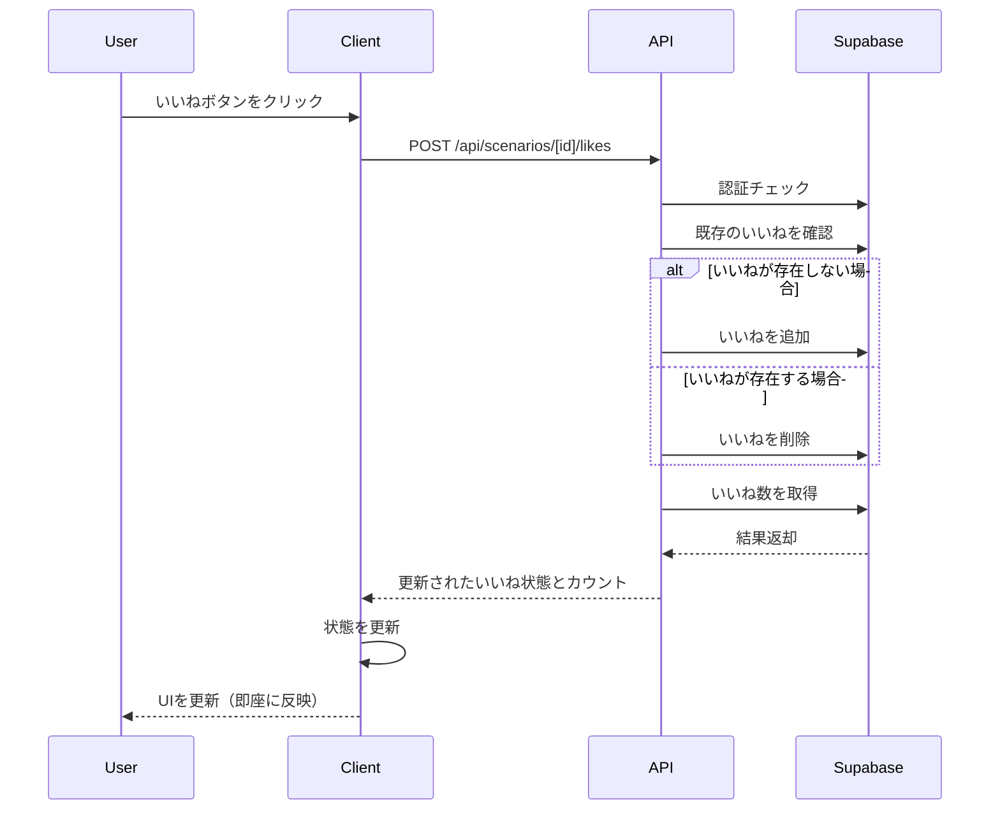
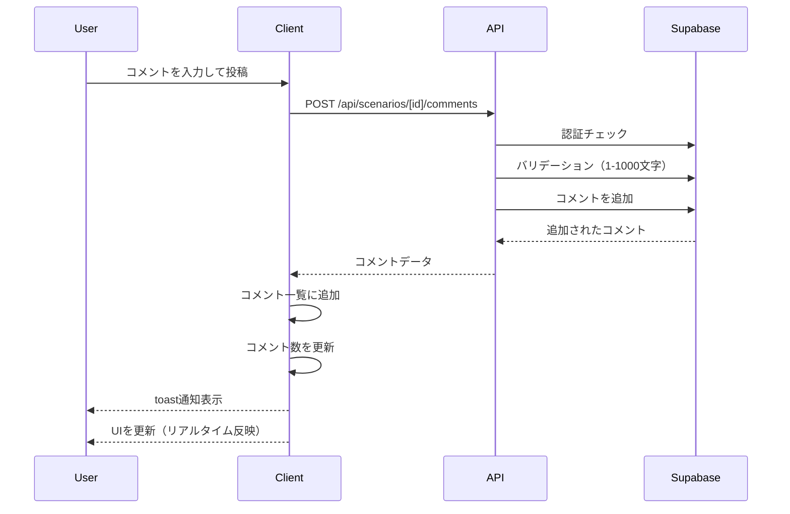
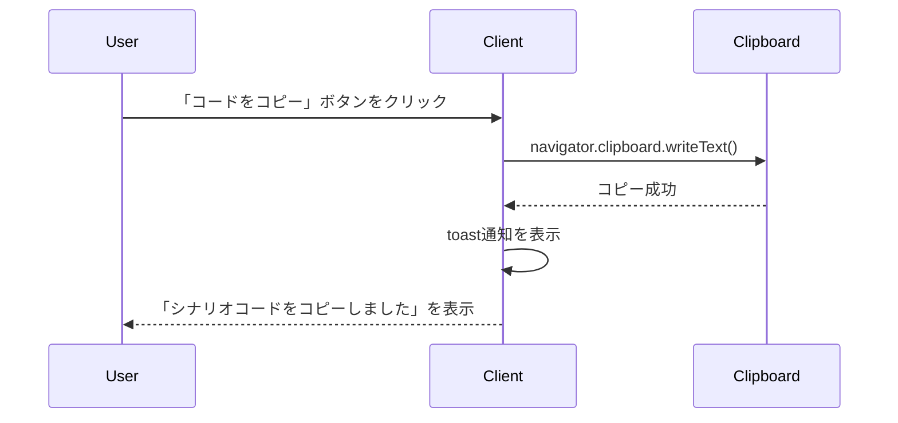

# シナリオ詳細ページとソーシャル（いいね・コメント）機能

## 概要

特定のシナリオの詳細情報をWAVEごとに表示し、ユーザーがコードのコピー、いいね、コメントを行えるようにする機能を実装しました。

## 変更内容

### データベース
- `likes` テーブルを作成（シナリオへのいいねを管理）
- `comments` テーブルを作成（シナリオへのコメントを管理）
- RLSポリシーを設定（全ユーザーが閲覧可能、認証済みユーザーのみ作成可能）

### API
- `GET /api/scenarios/[id]`: シナリオ詳細情報を取得
- `POST /api/scenarios/[id]/likes`: いいねを追加/削除（トグル式）
- `GET /api/scenarios/[id]/comments`: コメント一覧を取得
- `POST /api/scenarios/[id]/comments`: コメントを投稿

### フロントエンド
- `app/scenarios/[id]/page.tsx`: シナリオ詳細ページ（サーバーコンポーネント）
- `app/scenarios/[id]/ScenarioDetailClient.tsx`: クライアントコンポーネント（いいね・コメント機能）
- WAVE別詳細テーブル（潮位/イベントをバッジで色分け）
- シナリオコードの「ワンクリックコピー」ボタン
- いいねボタン（即座にカウント更新）
- コメント投稿・表示機能
- sonnerを使用したtoast通知

### その他
- `ScenarioCard`コンポーネントにリンクを追加
- `layout.tsx`にToasterを追加
- データベース型定義を更新
- テストファイルを追加

## 処理フロー

### シナリオ詳細ページ表示

### いいね機能

### コメント機能

### コードコピー機能

## テスト

以下のテストを追加しました：

- `GET /api/scenarios/[id]`: シナリオ詳細取得のテスト
- `POST /api/scenarios/[id]/likes`: いいね追加/削除のテスト
- `GET /api/scenarios/[id]/comments`: コメント一覧取得のテスト
- `POST /api/scenarios/[id]/comments`: コメント投稿のテスト

## UI/UXの改善

- **潮位の色分け**: 干潮（青）、普通（緑）、満潮（赤）で視覚的に分かりやすく表示
- **即座のフィードバック**: いいねボタンを押すと即座にカウントが更新される
- **Toast通知**: コピー成功、コメント投稿成功などの操作結果を通知
- **レスポンシブデザイン**: モバイル・デスクトップ両対応

## 関連Issue

Closes #12

