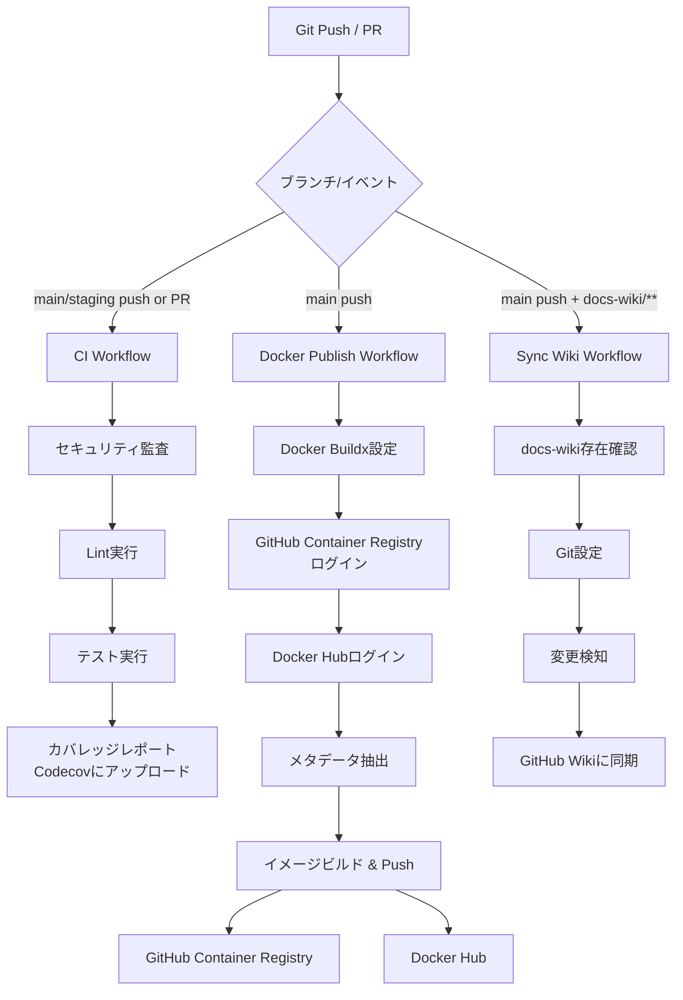
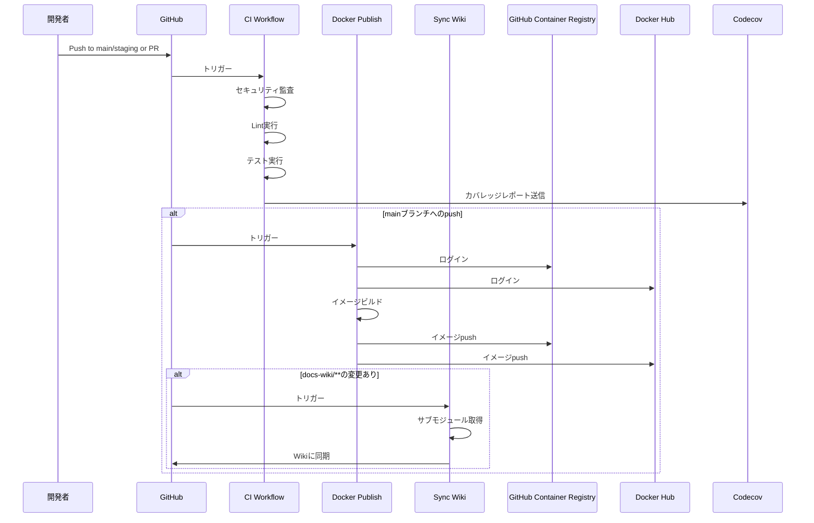

# Salmon Run Scenario Hub

[](https://codecov.io/github/eddie-splatoon/salmon-run-scenario-hub)

Next.js 16 (App Router)、Tailwind CSS、TypeScript、Supabaseを使用したプロジェクトです。

## セットアップ

### 1. 依存関係のインストール

```bash
npm install
```

### 2. 環境変数の設定

`.env.local`ファイルを作成し、以下の環境変数を設定してください：

```env
NEXT_PUBLIC_SUPABASE_URL=your_supabase_project_url
NEXT_PUBLIC_SUPABASE_ANON_KEY=your_supabase_anon_key
GEMINI_API_KEY=your_gemini_api_key
GEMINI_MODEL_NAME=gemini-1.5-pro  # オプション: デフォルトは gemini-1.5-pro
```

**注意**: 
- `GEMINI_API_KEY`はGoogle AI Studio（https://aistudio.google.com/app/apikey）で取得できます。
- `GEMINI_MODEL_NAME`は利用可能なモデル名を指定します（例: `gemini-1.5-pro`, `gemini-1.5-flash-002`）。
  利用可能なモデルを確認するには: `curl "https://generativelanguage.googleapis.com/v1beta/models?key=YOUR_API_KEY"`

### 3. SupabaseでのGoogle認証設定

1. Supabase Dashboardにログイン
2. **Authentication** > **Providers** > **Google** を開く
3. Google認証を有効化
4. Google Cloud ConsoleでOAuth 2.0クライアントIDとシークレットを取得
5. SupabaseにクライアントIDとシークレットを設定
6. リダイレクトURLを設定：
   - `https://your-project-ref.supabase.co/auth/v1/callback`
   - 開発環境の場合: `http://localhost:3000/auth/callback`

### 4. 開発サーバーの起動

```bash
npm run dev
```

ブラウザで [http://localhost:3000](http://localhost:3000) を開いてください。

### 5. テストの実行

```bash
# テストを実行
npm run test

# テストUIを開く
npm run test:ui

# カバレッジレポートを生成
npm run test:coverage
```

### 6. Dockerでの起動

```bash
# Dockerイメージをビルド
docker-compose build

# コンテナを起動
docker-compose up

# バックグラウンドで起動
docker-compose up -d
```

## プロジェクト構成

```
salmon-run-scenario-hub/
├── app/
│   ├── auth/
│   │   ├── callback/
│   │   │   └── route.ts          # OAuthコールバック処理
│   │   └── login/
│   │       └── page.tsx          # ログインページ
│   ├── types/
│   │   └── database.types.ts     # Supabaseデータベース型定義
│   ├── globals.css               # グローバルスタイル
│   ├── layout.tsx                # ルートレイアウト
│   └── page.tsx                  # ホームページ
├── app/
│   ├── api/
│   │   └── analyze/
│   │       └── route.ts          # 画像解析APIエンドポイント
│   ├── components/
│   │   └── ImageAnalyzer.tsx     # 画像アップロード・解析UIコンポーネント
│   └── types/
│       └── analyze.ts            # 画像解析APIの型定義
├── lib/
│   ├── ai/
│   │   └── prompt.ts             # Gemini API用のシステムプロンプト
│   ├── auth/
│   │   └── google-auth.ts        # Google認証ヘルパー関数
│   ├── supabase/
│   │   ├── client.ts             # クライアント側Supabaseクライアント
│   │   └── server.ts             # サーバー側Supabaseクライアント
│   └── utils/
│       └── master-lookup.ts      # マスタデータの名寄せユーティリティ
├── proxy.ts                      # 認証ミドルウェア（Next.js 16の新しい命名規則）
├── package.json
├── tsconfig.json
├── tailwind.config.ts
└── next.config.mjs
```

## Google認証の使用方法

### クライアントコンポーネントでの使用例

```typescript
'use client'

import { signInWithGoogle, signOut, getCurrentUser } from '@/lib/auth/google-auth'

// Googleでログイン
await signInWithGoogle()

// ログアウト
await signOut()

// 現在のユーザーを取得
const user = await getCurrentUser()
```

### サーバーコンポーネントでの使用例

```typescript
import { createClient } from '@/lib/supabase/server'

const supabase = await createClient()
const { data: { user } } = await supabase.auth.getUser()
```

## CI/CD

このリポジトリでは、GitHub Actionsを利用してCI/CDパイプラインを構築しています。

### ワークフロー概要



### CI (継続的インテグレーション)

**ワークフロー**: `.github/workflows/ci.yml`

**トリガー**:
- `main`または`staging`ブランチへのpush
- `main`または`staging`ブランチへのプルリクエスト

**実行内容**:
1. **セキュリティ監査**: `npm audit --audit-level=high`で高レベルの脆弱性をチェック
2. **Lint実行**: ESLintによるコード品質チェック
3. **テスト実行**: Vitestによる単体テストとカバレッジ計測
4. **カバレッジレポート**: Codecovにテスト結果とカバレッジレポートをアップロード

**必要なSecrets**:
- `CODECOV_TOKEN`: Codecovへのアップロード用トークン

### CD (継続的デリバリー)

**ワークフロー**: `.github/workflows/docker-publish.yml`

**トリガー**:
- `main`ブランチへのpush

**実行内容**:
1. **Docker Buildx設定**: マルチプラットフォームビルドの準備
2. **レジストリログイン**:
   - GitHub Container Registry (`ghcr.io`)
   - Docker Hub
3. **メタデータ抽出**: イメージタグの自動生成
   - ブランチ名タグ
   - SHAプレフィックス付きタグ
   - `latest`タグ（`main`ブランチの場合のみ）
4. **イメージビルド & Push**: 
   - GitHub Container RegistryとDocker Hubの両方に同じイメージをpush
   - GitHub Actionsキャッシュを活用した高速ビルド

**必要なSecrets**:
- `DOCKERHUB_USERNAME`: Docker Hubのユーザー名
- `DOCKERHUB_TOKEN`: Docker Hubのアクセストークン

**イメージタグ形式**:
- `ghcr.io/eddie-splatoon/salmon-run-scenario-hub:main`
- `ghcr.io/eddie-splatoon/salmon-run-scenario-hub:main-<sha>`
- `ghcr.io/eddie-splatoon/salmon-run-scenario-hub:latest` (mainブランチのみ)
- `{DOCKERHUB_USERNAME}/salmon-run-scenario-hub:main`
- `{DOCKERHUB_USERNAME}/salmon-run-scenario-hub:main-<sha>`
- `{DOCKERHUB_USERNAME}/salmon-run-scenario-hub:latest` (mainブランチのみ)

### Wiki同期

**ワークフロー**: `.github/workflows/sync-wiki.yml`

**トリガー**:
- `main`ブランチへのpush（`docs-wiki/**`パスへの変更時）
- 手動実行（`workflow_dispatch`）

**実行内容**:
1. **サブモジュールチェックアウト**: `docs-wiki`サブモジュールを取得
2. **存在確認**: `docs-wiki`ディレクトリの存在を確認
3. **Git設定**: Wikiリポジトリへのアクセス用にGit設定
4. **変更検知**: `docs-wiki`内の変更を検知
5. **Wiki同期**: 変更がある場合、GitHub Wikiリポジトリに自動的に同期

**必要なSecrets**:
- `WIKI_SYNC_TOKEN`: GitHub Wikiへの書き込み権限を持つPersonal Access Token

**セットアップ手順**:
1. GitHubリポジトリのSettings > Secrets and variables > Actionsに移動
2. `WIKI_SYNC_TOKEN`を追加（Personal Access Token、`repo`スコープが必要）
3. `docs-wiki`サブモジュールを設定（既に設定済みの場合は不要）

### ワークフロー実行フロー



### ワークフロー実行状況の確認

GitHubリポジトリの**Actions**タブから、各ワークフローの実行状況を確認できます。

- ✅ **緑**: 成功
- ❌ **赤**: 失敗
- 🟡 **黄**: 実行中
- ⚪ **グレー**: スキップまたはキャンセル

## 次のステップ

- [ ] Supabaseプロジェクトの作成と環境変数の設定
- [ ] Google OAuth認証の設定
- [ ] ユーザー情報の表示
- [ ] 認証が必要なページの保護
