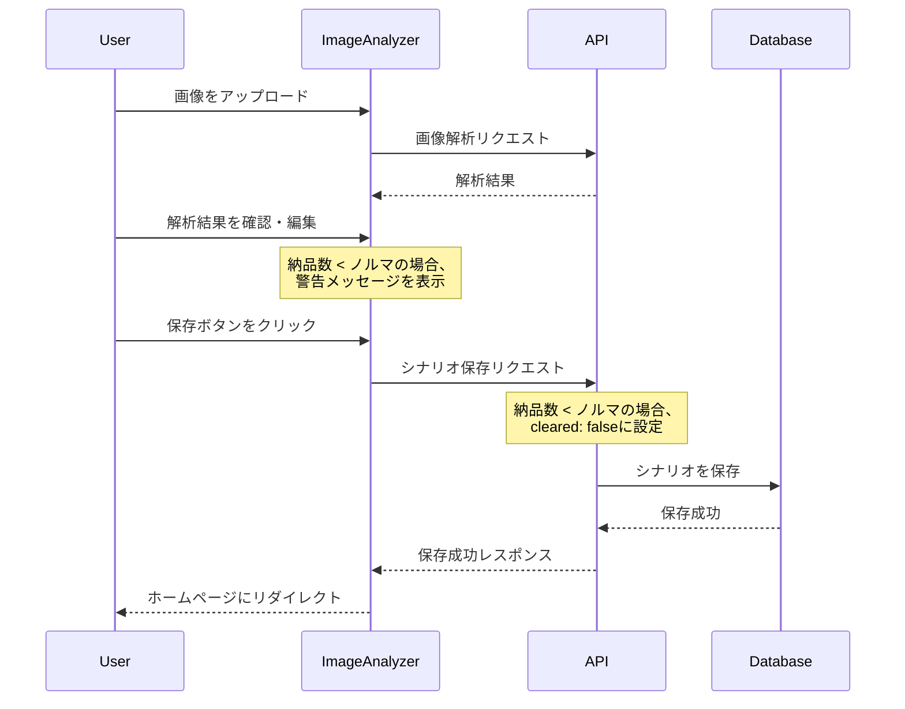

## 概要
`/analyze`画面のUI改善と、シナリオ保存時のバリデーションロジックの修正を行いました。

## 変更内容

### 1. `/analyze`画面のUI改善
- **レスポンシブ対応の強化**
  - ページレイアウトのパディングをレスポンシブに変更（スマホ: `px-4 py-8`、デスクトップ: `px-24 py-24`）
  - タイトルのフォントサイズをレスポンシブに調整
  - 入力フィールドのフォントサイズを16pxに統一（スマホでのズーム防止）
  - 入力フィールドのパディングを調整（タッチしやすく）
  - ボタンのレイアウトをレスポンシブに（スマホ: 縦並び、デスクトップ: 横並び）

- **フォームUIの改善**
  - セクション間のスペースをレスポンシブに調整
  - Gridのスペーシングをレスポンシブに調整
  - プレビュー画像の表示を改善
  - エラーメッセージ・警告メッセージのフォントサイズを調整

### 2. シナリオ保存時のバリデーション修正

#### 問題1: 納品数 < ノルマの場合の処理
**修正前**: 納品数 < ノルマの場合にエラーとなり登録できない

**修正後**: 
- 納品数 < ノルマの場合は、自動的に`cleared: false`（未クリア状態）として保存
- フロントエンドの警告メッセージを「⚠️ 納品数がノルマ未満です（未クリアとして保存されます）」に更新

#### 問題2: WAVE1のみでも保存可能に
**修正前**: WAVE1で失敗した場合、WAVE2以降が不明でも保存できない

**修正後**: 
- WAVE1だけでも保存できるように修正
- waves配列が空でないことを確認するバリデーションを追加（最低1つのWAVEがあれば保存可能）

## 処理フロー

## テスト
- [x] ESLintチェックを実行（エラーなし）
- [x] 既存のテストを更新（レスポンシブクラスの変更に対応）

## 関連Issue
このPRは、ユーザーからの要望に対応したものです。

