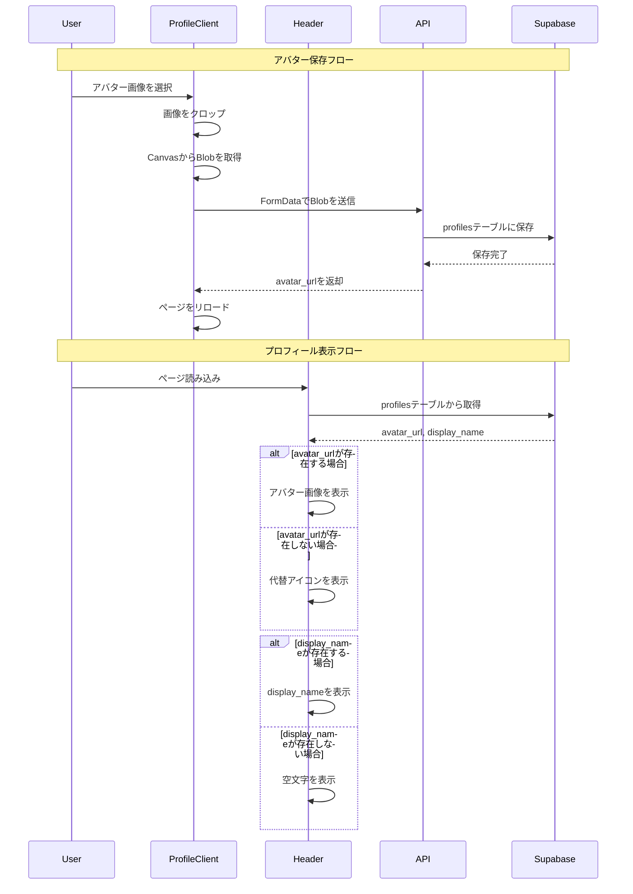

# アバターアイコンのCSP違反修正とプライバシー保護の強化

## 概要

アバターアイコンの保存時に発生していたContent Security Policy (CSP)違反を修正し、ユーザーのプライバシーを保護するため、Googleのデフォルト情報（アイコン・名前・emailアドレス）を表示しないように修正しました。

## 変更内容

### 1. アバター保存時のCSP違反修正

**問題**: アバター画像を保存する際、base64エンコードされたデータURL（`data:image/png;base64,...`）を`fetch`しようとして、CSPの`connect-src`ディレクティブに違反していました。

**修正**:
- `getCroppedImg`関数の戻り値を`Promise<string>`から`Promise<Blob>`に変更
- base64データURLを`fetch`する処理を削除し、Blobを直接`File`オブジェクトに変換するように変更

### 2. Googleのデフォルト情報の非表示

**問題**: 
- アップロードしたアイコンに切り替わる前に、Googleのデフォルトアイコン（`user.user_metadata.picture`）が一瞬表示されていた
- マイページで設定したニックネームが反映されず、Googleのデフォルト名（`user.user_metadata.full_name`、本名の可能性）が表示されていた
- emailアドレスが表示されており、プライバシー上の懸念があった

**修正**:
- `user.user_metadata.picture`を絶対に使用しないように修正（`profileAvatarUrl`がない場合は代替アイコンを表示）
- `user.user_metadata.full_name`を絶対に使用しないように修正（profilesテーブルの`display_name`を優先使用）
- emailアドレスの表示を削除（HeaderコンポーネントとProfileClientコンポーネントの両方）

### 3. profilesテーブルからの情報取得

- Headerコンポーネントで、profilesテーブルから`avatar_url`と`display_name`の両方を取得するように変更
- `profileDisplayName`ステートを追加し、表示名の管理を改善

## 処理フロー

## セキュリティとプライバシー

- Googleのデフォルト情報（`user_metadata.picture`、`user_metadata.full_name`）を絶対に表示しない
- emailアドレスを表示しない（秘匿性の高い情報のため）
- ユーザーが設定した情報（profilesテーブルの`display_name`、`avatar_url`）のみを使用

## テスト

- [x] ESLintチェックを実行（エラーなし）
- [x] アバター保存時のCSP違反が解消されることを確認
- [x] Googleのデフォルト情報が表示されないことを確認
- [x] emailアドレスが表示されないことを確認

## 関連ファイル

- `app/components/layout/Header.tsx` - Headerコンポーネントの修正
- `app/profile/ProfileClient.tsx` - ProfileClientコンポーネントの修正

