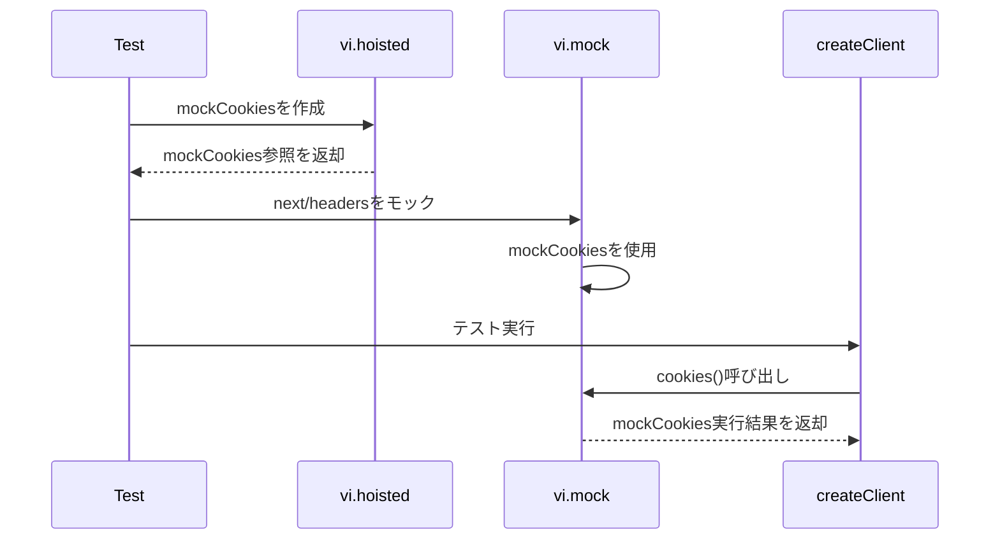

## 概要
`lib/supabase/__tests__/server.test.ts`で発生していた「Maximum call stack size exceeded」エラーを修正しました。

## 変更内容
- テスト内で`await import('next/headers')`を使用した再インポートが循環参照を引き起こしていた問題を修正
- `vi.hoisted()`で`mockCookies`を作成し、モック関数への参照を保持するように変更
- `vi.mock('next/headers')`で`mockCookies`を直接使用するように変更
- テスト内での再インポートを削除し、`mockCookies`を直接使用するように変更

## 問題の原因
テスト内で以下のように`await import('next/headers')`を使って再インポートしていたことが、循環参照を引き起こしていました：

```typescript
const { cookies } = await import('next/headers')
vi.mocked(cookies).mockImplementation(...)
```

これにより、以下の3つのテストケースで「Maximum call stack size exceeded」エラーが発生していました：
- `creates new client instance on each call`
- `passes Database type to createServerClient`
- `handles createServerClient errors`

## 修正内容
`vi.hoisted()`で`mockCookies`を作成し、モック関数への参照を保持するようにしました：

```typescript
const { mockCookies } = vi.hoisted(() => {
  const mockCookies = vi.fn(() => Promise.resolve(mockCookieStore))
  return { mockCookies }
})

vi.mock('next/headers', () => ({
  cookies: mockCookies,
}))
```

テスト内では、再インポートせずに`mockCookies`を直接使用するように変更しました。

## 処理フロー



## テスト
- [x] 既存のテストが正常に実行されることを確認
- [x] 「Maximum call stack size exceeded」エラーが解消されることを確認
- [x] ESLintチェックを実行し、エラーがないことを確認

## 関連Issue
該当するIssue番号が不明なため、記載していません。

