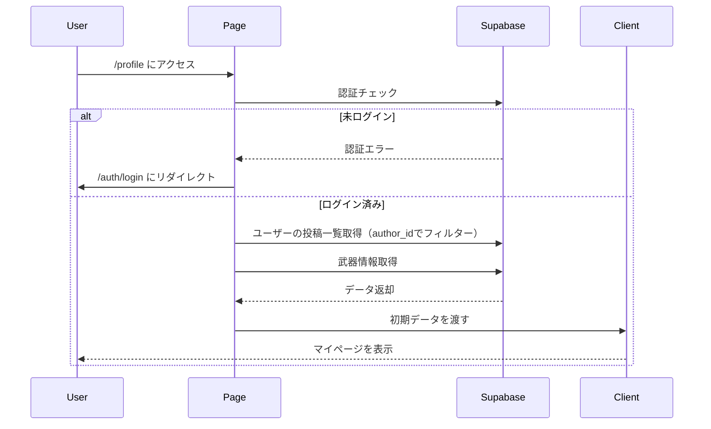
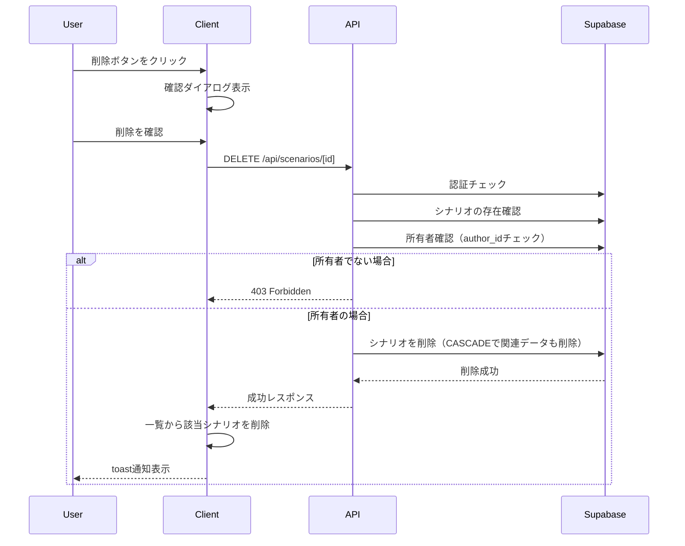
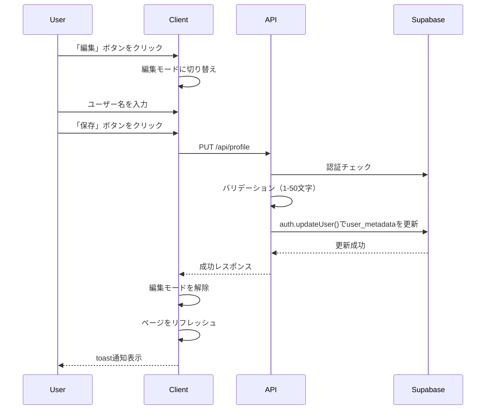

# ユーザーマイページと投稿管理機能

## 概要

ユーザーが自身の投稿履歴を管理し、プロフィール情報を編集できる機能を実装しました。

## 変更内容

### フロントエンド
- `app/profile/page.tsx`: マイページ（サーバーコンポーネント）
- `app/profile/ProfileClient.tsx`: マイページのクライアントコンポーネント
  - ユーザーの投稿一覧を表示
  - 投稿の削除機能
  - プロフィール編集機能（ユーザー名の変更）
- `app/components/layout/Header.tsx`: マイページへのリンクを追加

### API
- `DELETE /api/scenarios/[id]`: シナリオ削除エンドポイント
- `PUT /api/profile`: プロフィール更新エンドポイント

### テスト
- `app/api/__tests__/profile.test.ts`: プロフィール更新APIのテスト
- `app/api/__tests__/scenarios-delete.test.ts`: シナリオ削除APIのテスト

### セキュリティ
- 非ログイン時は`/auth/login`にリダイレクト
- シナリオ削除時は所有者確認を実施（RLSでも保護）
- プロフィール更新時は認証チェックを実施

## 処理フロー

### マイページ表示

### シナリオ削除

### プロフィール更新

## UI/UXの改善

- **投稿一覧**: 既存の`ScenarioCard`コンポーネントを再利用し、一貫したUI
- **削除ボタン**: 各シナリオカードに削除ボタンを配置（右上）
- **プロフィール編集**: インライン編集でユーザー名を変更可能
- **投稿日時の表示**: 各シナリオに投稿日時を表示
- **空状態の処理**: 投稿が0件の場合に適切なメッセージとアクションを表示
- **レスポンシブデザイン**: モバイル・デスクトップ両対応

## テスト

以下のテストを追加しました：

- `PUT /api/profile`: プロフィール更新のテスト
  - 正常系（更新成功）
  - 認証エラー（401）
  - バリデーションエラー（空文字、長さ制限）
  - 更新失敗エラー（500）
- `DELETE /api/scenarios/[id]`: シナリオ削除のテスト
  - 正常系（削除成功）
  - 認証エラー（401）
  - シナリオ不存在（404）
  - 権限エラー（403）
  - 削除失敗エラー（500）

## セキュリティ考慮事項

- **RLS（Row Level Security）**: データベースレベルでシナリオ削除権限を制限
- **APIレベルでの所有者確認**: RLSに加えて、APIでも所有者を確認（二重の保護）
- **認証チェック**: すべてのAPIエンドポイントで認証チェックを実施
- **バリデーション**: プロフィール更新時の入力値バリデーション

## 関連Issue

Closes #14

