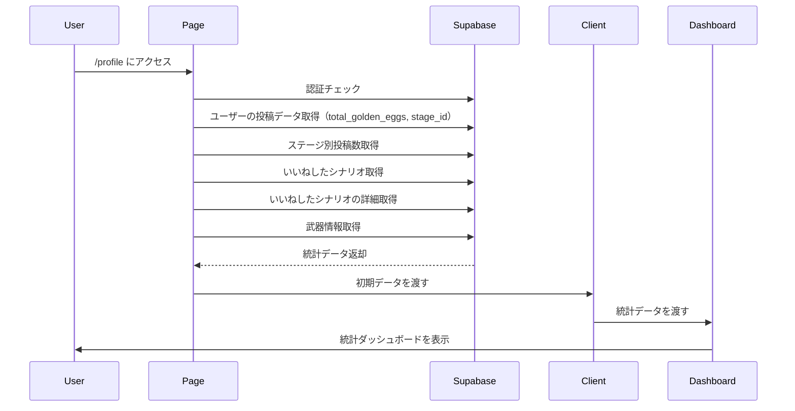
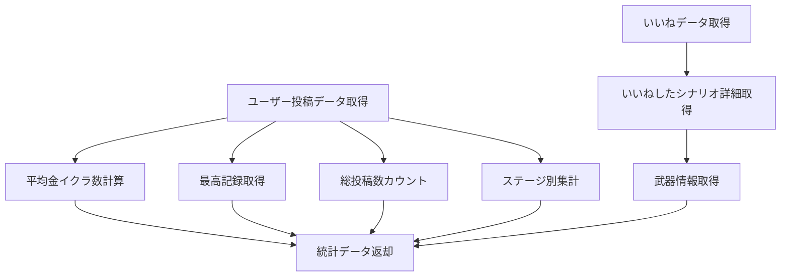
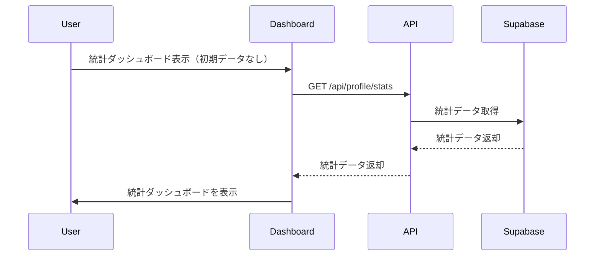

# ユーザー統計ダッシュボード機能

## 概要

ユーザーのこれまでの全投稿データを集計し、実績（平均納品数など）を可視化する統計ダッシュボード機能を実装しました。これにより、ユーザーの継続利用を促進します。

## 変更内容

### フロントエンド
- `app/components/StatisticsDashboard.tsx`: 統計ダッシュボードコンポーネント
  - サマリーカード（平均金イクラ数、最高記録、総投稿数）
  - ステージ別投稿数のパイチャート（Recharts使用）
  - お気に入り（いいねした）シナリオの一覧表示
- `app/profile/page.tsx`: 統計データ取得関数を追加
- `app/profile/ProfileClient.tsx`: 統計ダッシュボードを統合

### API
- `GET /api/profile/stats`: ユーザー統計データ取得エンドポイント
  - 平均金イクラ数の計算
  - 最高記録（最大金イクラ数）の取得
  - 総投稿数の取得
  - ステージ別投稿数の集計
  - お気に入り（いいねした）シナリオの取得

### ライブラリ
- `recharts`: チャート表示用ライブラリを追加

### テスト
- `app/api/__tests__/profile-stats.test.ts`: 統計データ取得APIのテスト
- `app/components/__tests__/StatisticsDashboard.test.tsx`: 統計ダッシュボードコンポーネントのテスト

## 処理フロー

### 統計ダッシュボード表示

### 統計データ計算

### リアルタイム更新

## 技術的な詳細

### データ集計
- 平均金イクラ数: 全投稿の`total_golden_eggs`の平均値（小数点第1位まで）
- 最高記録: 全投稿の`total_golden_eggs`の最大値
- ステージ別投稿数: `GROUP BY stage_id`で集計し、ステージ名と件数を取得

### チャート表示
- Rechartsの`PieChart`を使用してステージ別投稿数を可視化
- 7色のカラーパレットを使用（ステージ数が多い場合も対応）

### お気に入りシナリオ
- `likes`テーブルからユーザーがいいねしたシナリオコードを取得
- 取得したシナリオコードで`scenarios`テーブルから詳細情報を取得
- 武器情報も取得して、`ScenarioCard`コンポーネントで表示

## セキュリティ

- 非ログイン時は`/auth/login`にリダイレクト
- 統計データ取得時は認証チェックを実施
- RLS（Row Level Security）により、ユーザーは自分の投稿データのみアクセス可能

## テスト

- 統計データ取得APIのテスト（認証チェック、データ集計、エラーハンドリング）
- 統計ダッシュボードコンポーネントのテスト（表示、ローディング、エラー処理）

## 関連Issue

Closes #15

