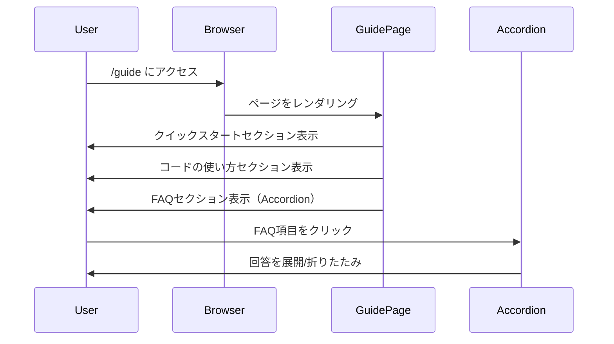
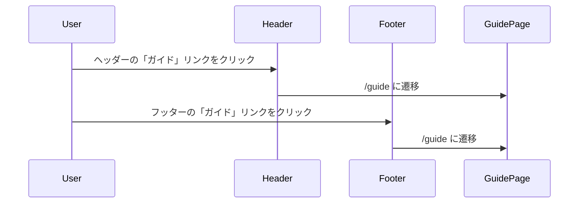

# ユーザーガイド・FAQページの構築

## 概要

初めてサイトを訪れたユーザーや、AI解析がうまくいかないユーザーをサポートするための解説ページを作成しました。クイックスタート、コードの使い方、FAQセクションを実装し、ユーザーが迷うことなくSwitch実機でシナリオを再生できるようになります。

## 変更内容

### フロントエンド
- `app/guide/page.tsx`: ユーザーガイドページ
  - クイックスタート: Switchでのスクリーンショット撮影から投稿までの流れ
  - コードの使い方: ゲーム内での「シナリオコード」入力方法の図解
  - FAQ: 読み取りエラー時の対処法、対応デバイス、プライバシーについて（アコーディオン形式）

### UIコンポーネント
- `app/components/ui/Accordion.tsx`: shadcn/uiスタイルのAccordionコンポーネント
  - Radix UIのAccordionプリミティブを使用
  - ダークテーマに対応したスタイリング

### ナビゲーション
- `app/components/layout/Header.tsx`: ガイドページへのリンクを追加（デスクトップ・モバイル両対応）
- `app/components/layout/Footer.tsx`: ガイドページへのリンクを追加

### スタイル
- `app/globals.css`: Accordionアニメーション用のCSSを追加

### 依存関係
- `@radix-ui/react-accordion`: Accordionコンポーネント用パッケージを追加

### テスト
- `app/guide/__tests__/page.test.tsx`: ガイドページのテスト
  - メイン見出しの表示確認
  - 各セクション（クイックスタート、コードの使い方、FAQ）の表示確認
  - FAQ項目の表示確認
  - リンクの動作確認

## 処理フロー

### ガイドページ表示

### ナビゲーション

## 実装の詳細

### Accordionコンポーネント

Radix UIのAccordionプリミティブをベースに、プロジェクトのデザインシステムに合わせたスタイリングを適用しました。

- ダークテーマ対応
- スムーズなアニメーション
- アクセシビリティ対応（キーボード操作、スクリーンリーダー対応）

### FAQセクション

以下の5つのFAQ項目を実装：

1. **AI解析でエラーが出る場合はどうすればいいですか？**
   - 画像の品質、向き、ファイル形式、ファイルサイズの確認方法

2. **どのデバイスから利用できますか？**
   - パソコン、スマートフォン、タブレット対応の説明

3. **どのような画像をアップロードすればいいですか？**
   - リザルト画面全体、鮮明な画像、横向き、ファイル形式の要件

4. **プライバシーについて教えてください**
   - 画像データの取り扱い、個人情報、認証情報の説明

5. **解析結果が正しくない場合はどうすればいいですか？**
   - 再アップロード、手動修正、フィードバック送信の方法

## テスト

- [x] 単体テストを追加
- [x] 各セクションの表示確認
- [x] リンクの動作確認
- [x] FAQ項目の表示確認

## 関連Issue

Closes #23

