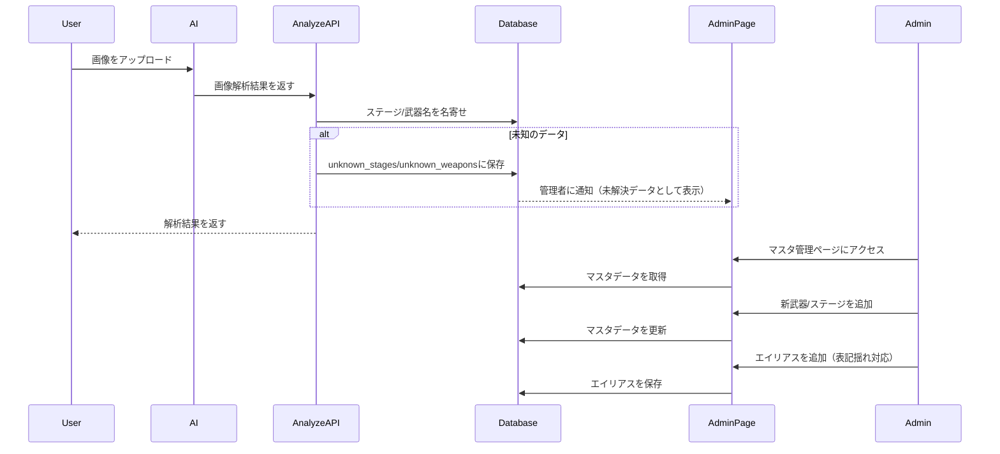

## 概要
武器・ステージマスタの自動更新/管理ロジックの強化を実装しました。新シーズン開始時にコード修正なしで新しい武器やステージを追加・反映できるようになりました。

## 変更内容
- 管理者権限の実装（管理者テーブルとRLSポリシーの追加）
- 未知データ保存テーブルの作成（unknown_stages, unknown_weapons）
- AI解析ロジックの更新（未知データの保存と通知）
- 名寄せ辞書の同期機能（エイリアステーブルの作成）
- 管理者用マスタ管理ページの作成（/admin/masters）
- マスタ管理APIの作成（CRUD操作）

## 処理フロー

## データベース変更
- `admins`テーブル: 管理者権限を管理
- `unknown_stages`テーブル: 未知のステージを保存
- `unknown_weapons`テーブル: 未知の武器を保存
- `stage_aliases`テーブル: ステージ名のエイリアス（名寄せ用）
- `weapon_aliases`テーブル: 武器名のエイリアス（名寄せ用）

## テスト
- [x] 管理者権限チェックのテスト
- [x] マスタ管理APIのテスト
- [x] 名寄せロジックのテスト（エイリアス対応）

## 関連Issue
Closes #24

