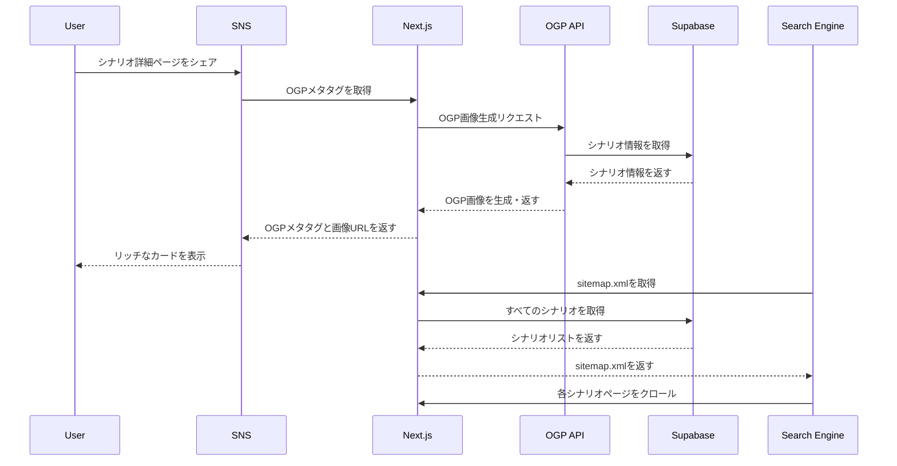

## 概要
SNSでシェアされた際、シナリオの内容（ステージ名やスコア）が画像として表示されるようにし、流入数を増加させる。また、検索エンジンからのオーガニック流入を改善する。

## 変更内容
- シナリオ詳細ページに`generateMetadata`を実装
- OGP画像生成APIルートを作成（`@vercel/og`使用）
- `sitemap.xml`と`robots.txt`を自動生成
- テストを追加

## 処理フロー

## 技術詳細

### OGP画像生成
- `@vercel/og`を使用して動的にOGP画像を生成
- シナリオ情報（ステージ名、金イクラ数、危険度、武器構成）を画像に埋め込む
- Edge Runtimeで実行（高速化）

### メタデータ生成
- Next.js 16の`generateMetadata`を使用
- Open GraphとTwitter Cardの両方に対応
- シナリオごとに固有のメタデータを生成

### SEO最適化
- `sitemap.xml`を自動生成（すべてのシナリオを含む）
- `robots.txt`を自動生成（APIと管理者ページを除外）

## テスト
- [x] OGP画像生成APIのテスト
- [x] sitemap生成のテスト
- [x] robots.txt生成のテスト

## 関連Issue
Closes #25

