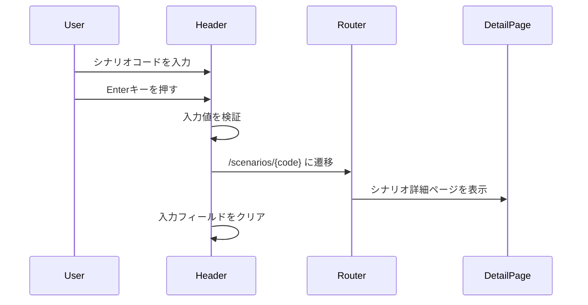
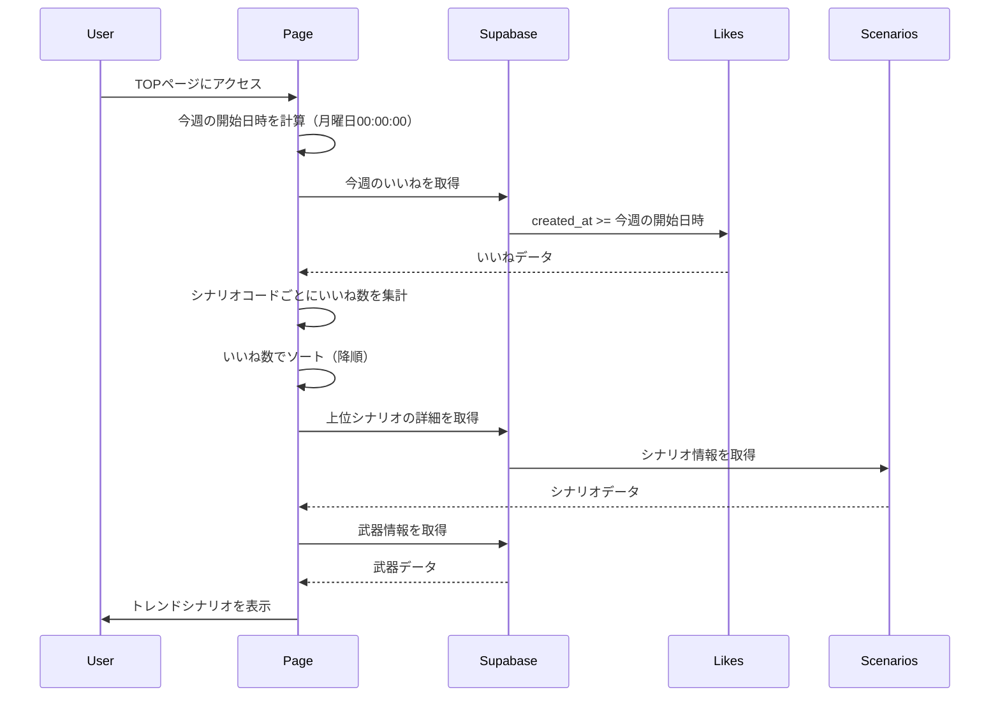
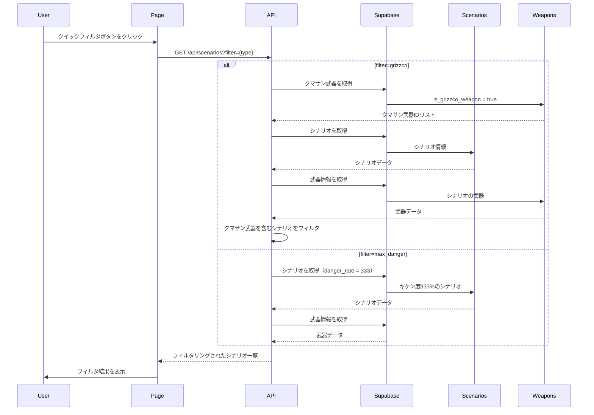

# サイト内検索機能の強化と「今週のトレンド」表示

## 概要

ユーザーが特定のシナリオをより早く見つけられるようにし、また活発なコミュニティ感を演出するため、以下の機能を実装しました。

## 変更内容

### フロントエンド

#### ヘッダー
- `app/components/layout/Header.tsx`: シナリオコード直接入力検索窓を追加
  - デスクトップとモバイルの両方に対応
  - 16桁のシナリオコードを入力して即座に詳細ページへ遷移
  - 検索アイコン付きの入力フィールド

#### TOPページ
- `app/page.tsx`: 「今週のトレンド」セクションを追加
  - 今週（月曜日00:00:00から）のいいね数が多いシナリオをランキング表示
  - いいね数バッジ付きで表示
  - クイックフィルタボタンを追加
    - `#クマサン印あり`: クマサン印の武器を含むシナリオをフィルタ
    - `#カンスト向け`: キケン度333%のシナリオをフィルタ

### API

- `app/api/scenarios/route.ts`: クイックフィルタのパラメータ処理を追加
  - `filter=grizzco`: クマサン印の武器を含むシナリオをフィルタ
  - `filter=max_danger`: キケン度333%のシナリオをフィルタ

### テスト

- `app/components/layout/__tests__/Header.test.tsx`: ヘッダー検索機能のテスト
  - 検索入力の表示確認
  - シナリオコード入力時の遷移確認
  - 検索後の入力クリア確認
  - 最大文字数制限の確認

- `app/api/__tests__/scenarios.test.ts`: クイックフィルタのテスト
  - `filter=max_danger`のテスト
  - `filter=grizzco`のテスト

## 処理フロー

### シナリオコード検索

### 今週のトレンド取得

### クイックフィルタ

## テスト

- [x] ヘッダー検索機能の単体テスト
- [x] クイックフィルタAPIのテスト
- [x] 今週のトレンド取得の動作確認

## 関連Issue

Closes #26

