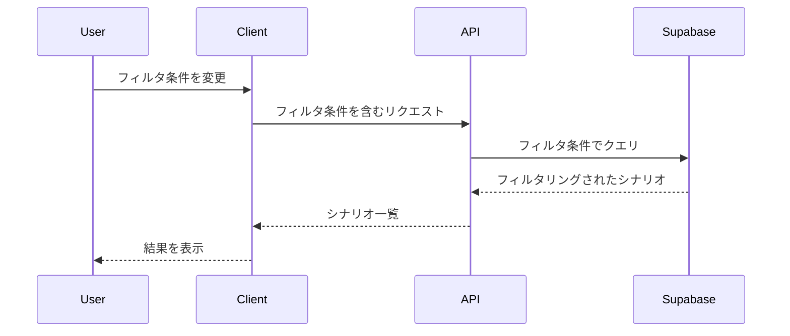
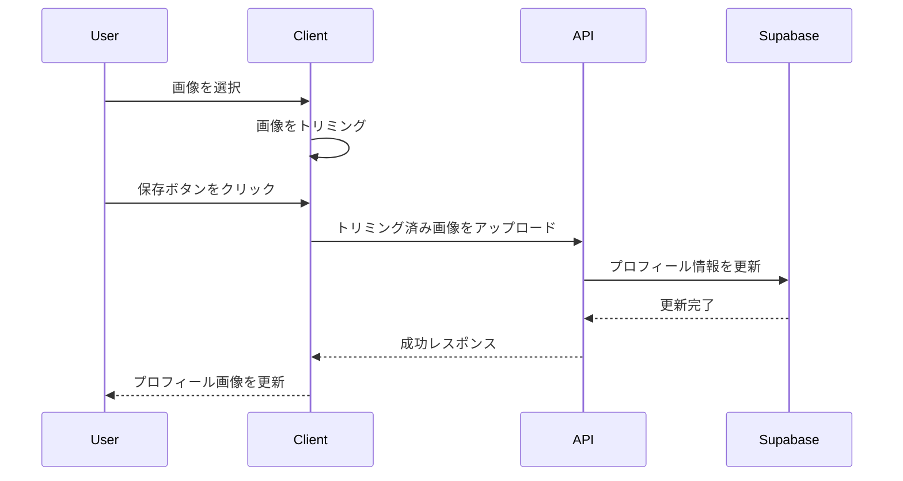

## 概要
Issue #36のUI改善を実装しました。シナリオカードの表示改善、シナリオ一覧ページの追加、プロフィール画像アップロード機能、利用規約・プライバシーポリシーページの追加などを行いました。

## 変更内容
- MUIを導入し、プルダウンなどの入力項目をリッチにしました
- ScenarioCardにフッタを追加し、トレンドやトラッシュアイコンをフッタに移動しました
- シナリオ一覧ページ（/scenarios）を作成し、カード表示とテーブル表示を切り替え可能にしました
- TOPページの「すべて見る」リンクを新しいシナリオ一覧ページに遷移させました
- プロフィールページにアイコンアップロード・トリミング機能を追加しました
- 利用規約とプライバシーポリシーのページを作成しました
- シナリオ一覧ページに詳細なフィルタ機能を追加しました（ステージ、武器、キケン度）

## 処理フロー

### シナリオ一覧ページのフィルタリング

### プロフィール画像アップロード

## テスト
- [x] ESLintチェックを実行し、エラーがないことを確認
- [x] 既存のテストが動作することを確認

## 関連Issue
Closes #36

