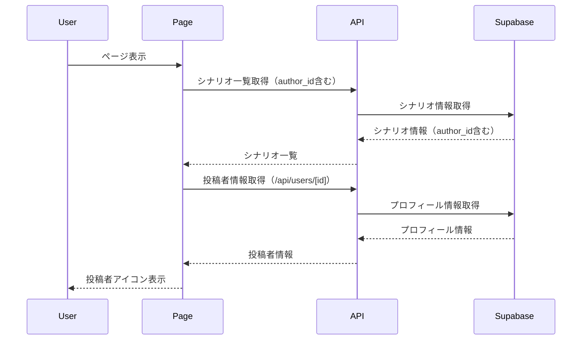
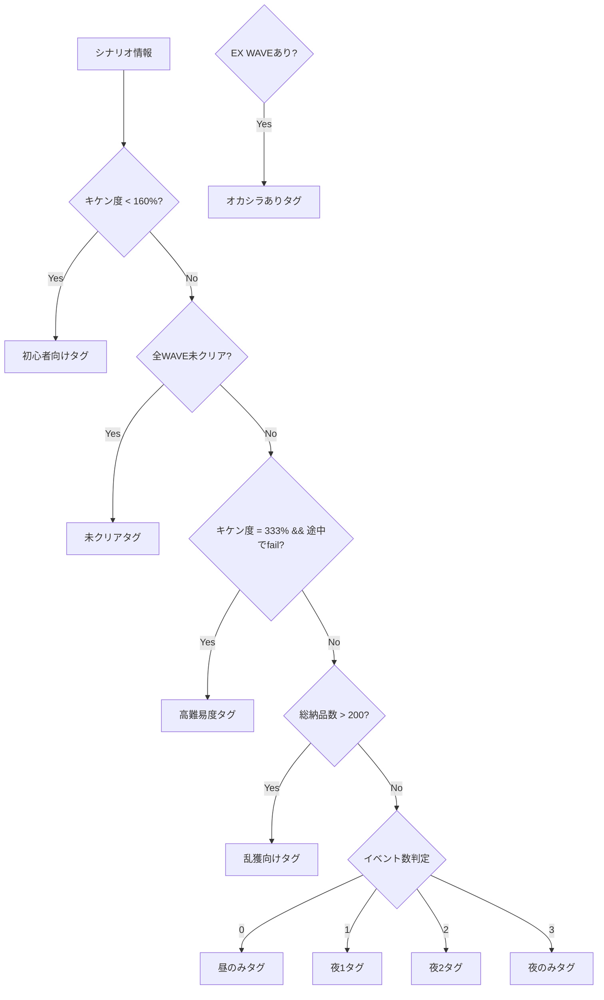

## 概要
Issue #38のUI改善を実装しました。シナリオカードとシナリオ詳細に投稿者情報を表示し、ハッシュタグ機能を追加、ヘッダーのユーザー表示を改善しました。

## 変更内容
- シナリオカードに投稿者アイコンを表示
- シナリオ詳細に投稿者情報を表示
- ハッシュタグ機能の追加（シナリオ詳細画面に表示）
- ヘッダーのユーザー表示改善（アイコン表示、Email非表示）
- シナリオ一覧にクマサン印フィルタを追加
- プロフィールテーブルの作成
- 管理者登録用のマイグレーションファイル追加

## 処理フロー

## ハッシュタグの計算ロジック

## テスト
- [x] ESLintチェック完了
- [ ] 単体テストを追加（将来の改善項目）
- [ ] 統合テストを実行（将来の改善項目）
- [ ] 手動テストを実施

## 注意事項
- プロフィールテーブル（`profiles`）を作成するマイグレーションを追加しました。マイグレーションを実行してください。
- 管理者の登録は、Supabase Dashboardで手動で実行する必要があります（`supabase/migrations/010_add_admin_eddie.sql`を参照）。
- TOPページのフィルタ機能改善（クライアントサイドフィルタリング、スクロール位置保持）は、大きな変更になるため、将来の改善項目として残しています。

## 関連Issue
Closes #38

