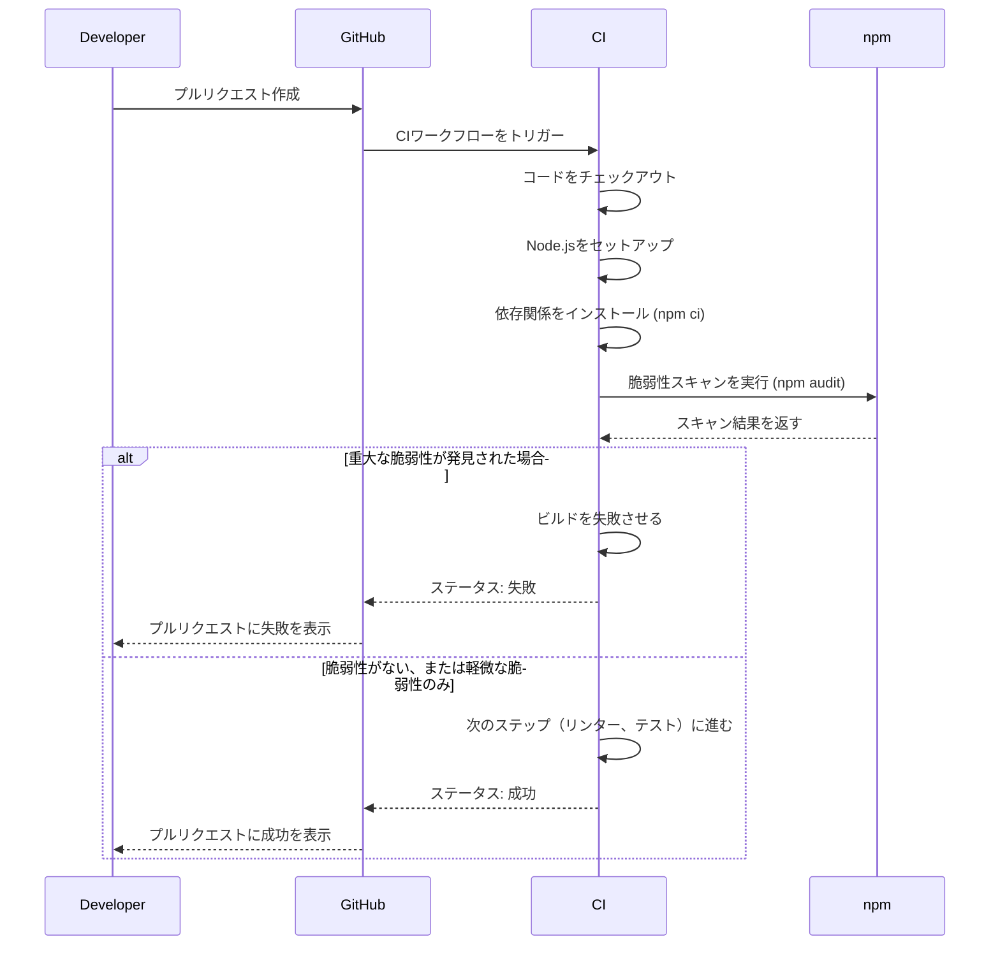

## 概要

CIでの依存関係脆弱性スキャンの自動化を実装しました。GitHub Actionsに`npm audit`を組み込み、プルリクエスト作成時に自動で脆弱性チェックを実行し、重大な脆弱性が発見された場合にビルドを失敗させるようにしました。

## 変更内容

- GitHub ActionsのCIワークフローに脆弱性スキャンステップを追加
  - `npm audit --audit-level=high`を実行
  - 重大な脆弱性（high以上）が発見された場合にビルドを失敗させる設定
- package.jsonにauditスクリプトを追加
  - `npm run audit`: 脆弱性スキャンを実行
  - `npm run audit:fix`: 自動修正可能な脆弱性を修正

## 処理フロー

## テスト

- [x] CIワークフローが正常に実行されることを確認
- [x] 脆弱性スキャンが適切に実行されることを確認
- [x] ESLintチェックを実行し、エラーがないことを確認

## 関連Issue

Closes #41

