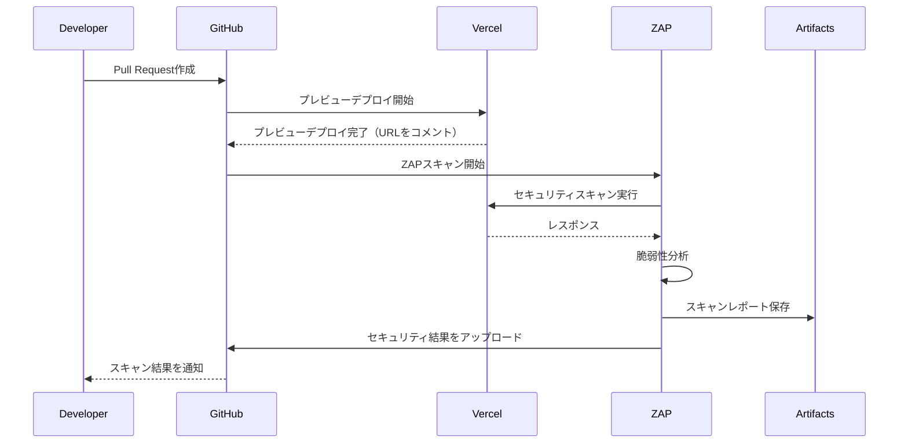

# OWASP ZAP を使用した動的セキュリティスキャン (DAST) の実装

## 概要

アプリケーションの実行環境に対し、外部から疑似的な攻撃（SQLi, XSS等）を仕掛け、脆弱性を検知するためのOWASP ZAPを使用した動的セキュリティスキャン（DAST）を実装しました。

## 変更内容

### 1. OWASP ZAPスキャンワークフローの追加

- `.github/workflows/zap-scan.yml`を新規作成
- Pull Request作成時に自動的にZAPスキャンを実行
- VercelのプレビューデプロイURLを自動取得
- スキャンレポートをGitHub Artifactsに保存（30日間保持）
- スキャン結果をGitHub Securityにアップロード

### 2. セキュリティヘッダーの追加

- `proxy.ts`に以下のセキュリティヘッダーを追加：
  - `X-Content-Type-Options: nosniff` - MIMEタイプスニッフィングを防止
  - `X-Frame-Options: DENY` - クリックジャッキング攻撃を防止
  - `X-XSS-Protection: 1; mode=block` - XSS攻撃の緩和
  - `Referrer-Policy: strict-origin-when-cross-origin` - リファラー情報の制御
  - `Permissions-Policy` - ブラウザ機能へのアクセス制限
  - `Content-Security-Policy` - XSSやインジェクション攻撃を防止
  - `Strict-Transport-Security` - HTTPS接続の強制（HTTPSリクエストの場合のみ）

### 3. セキュリティヘッダーのテスト追加

- `__tests__/proxy.test.ts`にセキュリティヘッダーのテストを追加
- 各セキュリティヘッダーが正しく設定されていることを確認
- HTTPS/HTTPリクエストでの動作を確認

## 処理フロー

## セキュリティヘッダーの設定詳細

### Content-Security-Policy (CSP)

以下のドメインとリソースを許可：
- Next.jsの静的リソース（`'self'`）
- Google認証（`accounts.google.com`, `www.googleapis.com`）
- Supabase（`*.supabase.co`, `*.supabase.in`）
- Google Fonts（`fonts.googleapis.com`, `fonts.gstatic.com`）
- 画像リソース（`data:`, `https:`, `blob:`）

### Permissions-Policy

以下の機能を無効化：
- `camera` - カメラアクセス
- `microphone` - マイクアクセス
- `geolocation` - 位置情報アクセス
- `interest-cohort` - FLoC（Federated Learning of Cohorts）

## テスト

- [x] セキュリティヘッダーの設定を確認するテストを追加
- [x] HTTPS/HTTPリクエストでの動作を確認
- [x] 既存のテストが正常に動作することを確認

## 使用方法

### 自動スキャン

Pull Requestを作成すると、自動的にZAPスキャンが実行されます。

### 手動スキャン

GitHub Actionsの「OWASP ZAP Security Scan」ワークフローを手動で実行し、対象URLを指定できます。

## 期待される効果

- リリース前に、基本的なWebの脆弱性が混入していないか機械的に確認できる
- セキュリティヘッダーにより、XSS、クリックジャッキング、MIMEタイプスニッフィングなどの攻撃を緩和
- 継続的なセキュリティチェックにより、セキュリティ品質の向上

## 関連Issue

Closes #42

