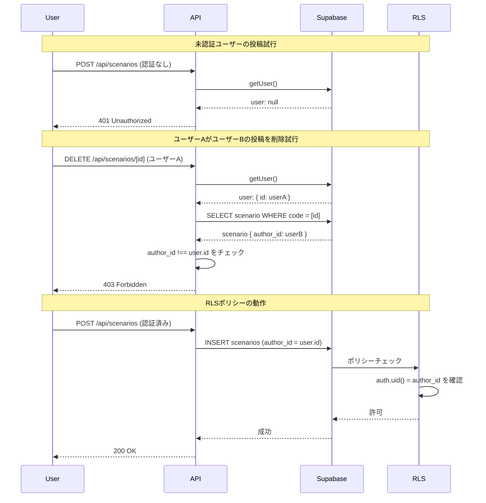

## 概要
Supabase RLS (Row Level Security) の整合性テストを追加しました。これにより、データベースの権限管理がコードレベルで担保され、情報漏洩や不正な操作を未然に防ぐことができます。

## 変更内容
- `app/api/__tests__/rls-security.test.ts` を新規作成
- 未認証ユーザーがシナリオを投稿できないことをテスト
- ユーザーAがユーザーBの投稿を削除できないことをテスト
- ユーザーAが自分の投稿を削除できることをテスト
- RLSをバイパスする脆弱なクエリが存在しないことをコードレビュー観点で確認

## 処理フロー

## テスト
- [x] 未認証ユーザーが投稿できないことを確認
- [x] ユーザーAがユーザーBの投稿を削除できないことを確認
- [x] ユーザーAが自分の投稿を削除できることを確認
- [x] author_idがリクエストボディから設定されないことを確認
- [x] APIレベルでの明示的な権限チェックが実装されていることを確認
- [x] ESLintチェック通過

## コードレビュー観点

### RLSポリシーの確認
以下のRLSポリシーが正しく設定されていることを確認しました：

1. **scenariosテーブル**
   - `scenarios_insert_authenticated`: 認証済みユーザーのみ作成可能、かつ `author_id = auth.uid()`
   - `scenarios_update_own`: 所有者のみ更新可能
   - `scenarios_delete_own`: 所有者のみ削除可能

2. **scenario_wavesテーブル**
   - `scenario_waves_insert_authenticated`: シナリオの所有者のみ挿入可能
   - `scenario_waves_update_authenticated`: シナリオの所有者のみ更新可能
   - `scenario_waves_delete_authenticated`: シナリオの所有者のみ削除可能

3. **scenario_weaponsテーブル**
   - `scenario_weapons_insert_authenticated`: シナリオの所有者のみ挿入可能
   - `scenario_weapons_update_authenticated`: シナリオの所有者のみ更新可能
   - `scenario_weapons_delete_authenticated`: シナリオの所有者のみ削除可能

### APIレベルでの防御
- `POST /api/scenarios`: 認証チェックを実装し、`author_id`は`user.id`から設定（リクエストボディからは設定されない）
- `DELETE /api/scenarios/[id]`: RLSに加えて、APIレベルでも明示的に所有者をチェック（防御の多層化）

## 関連Issue
Closes #43

