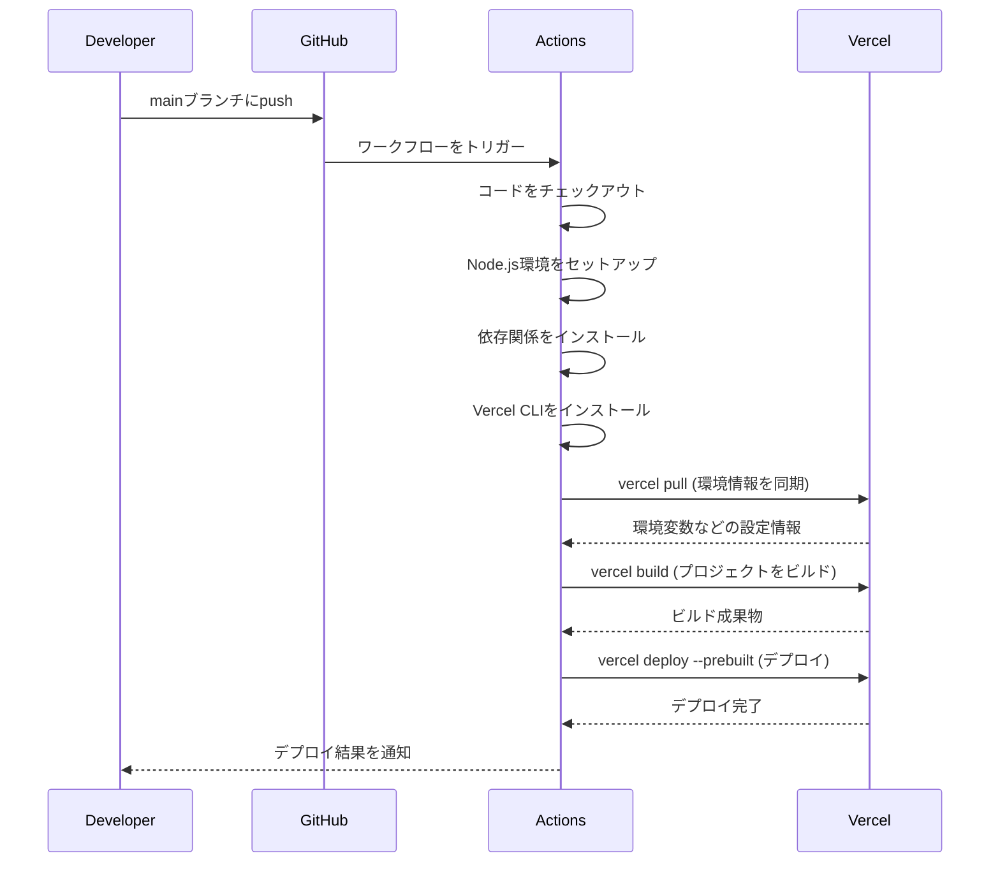
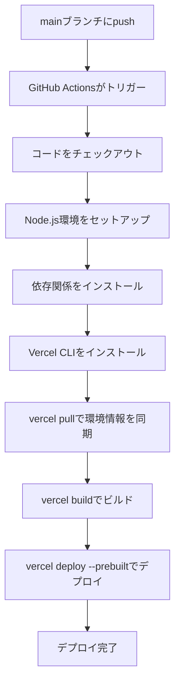

# GitHub Actions を利用した Vercel への自動デプロイの実装

## 概要

GitHubアカウントの名義に依存せず、Vercel CLIを使用してGitHub Actionsからデプロイを直接制御するパイプラインを構築しました。これにより、別名義のリポジトリからでもセキュアに本番環境への反映を可能にします。

## 変更内容

### CI/CD
- `.github/workflows/deploy.yml` を作成
- mainブランチへのプッシュをトリガーに設定
- Vercel CLI を使用したビルド・デプロイプロセスの実装
  - `vercel pull`: 環境情報の同期
  - `vercel build`: プロジェクトのビルド
  - `vercel deploy --prebuilt`: ビルド済み成果物のアップロード

## 処理フロー

### 自動デプロイフロー

### ワークフローの詳細ステップ

## 必要な設定

### GitHub Secrets

以下の3つの値を GitHub の [Settings > Secrets and variables > Actions] に登録する必要があります：

- `VERCEL_TOKEN`: VercelのAccount Settingsで発行したAPIトークン
- `VERCEL_ORG_ID`: Vercel上のチームID
- `VERCEL_PROJECT_ID`: プロジェクトID

### Vercelダッシュボード側での設定

- Vercelダッシュボード側での「Git連携（Disconnect）」を確認する必要があります（Git連携を無効化することで、GitHub Actionsからのデプロイを優先します）

## 技術的な詳細

### ワークフローの特徴

1. **セキュアな認証**: GitHub Secretsを使用してVercelの認証情報を安全に管理
2. **環境変数の同期**: `vercel pull`により、Vercelダッシュボードで設定した環境変数を自動的に同期
3. **ビルド済み成果物のデプロイ**: `--prebuilt`オプションにより、GitHub Actionsでビルドした成果物を直接デプロイ
4. **本番環境へのデプロイ**: `--prod`オプションにより、本番環境に直接デプロイ

### 使用している技術

- GitHub Actions
- Vercel CLI
- Node.js 24.11.1（package.jsonのvolta設定に合わせて指定）

## 関連Issue

Closes #51

