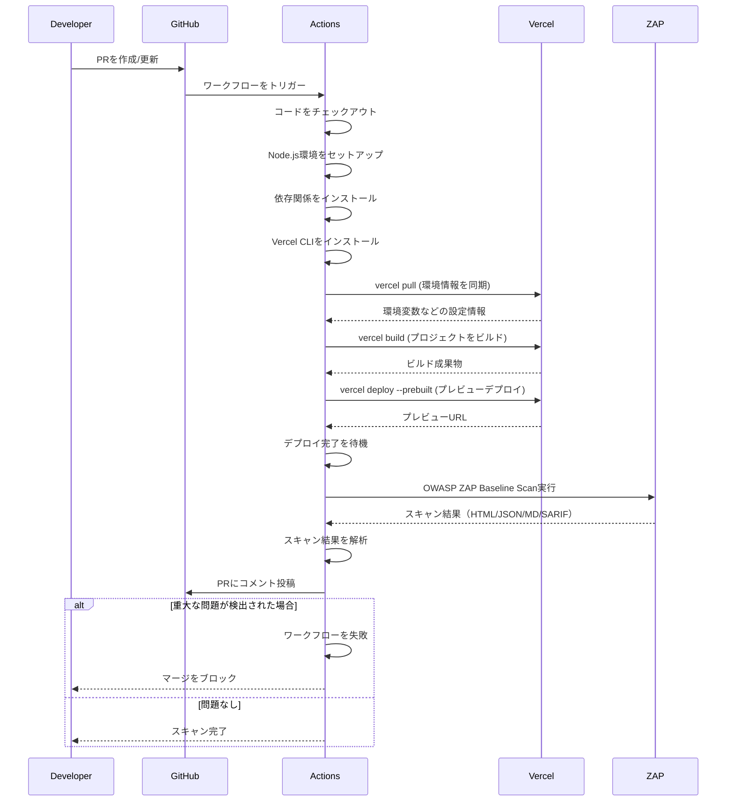
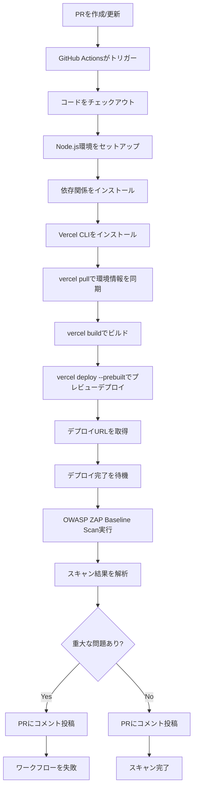
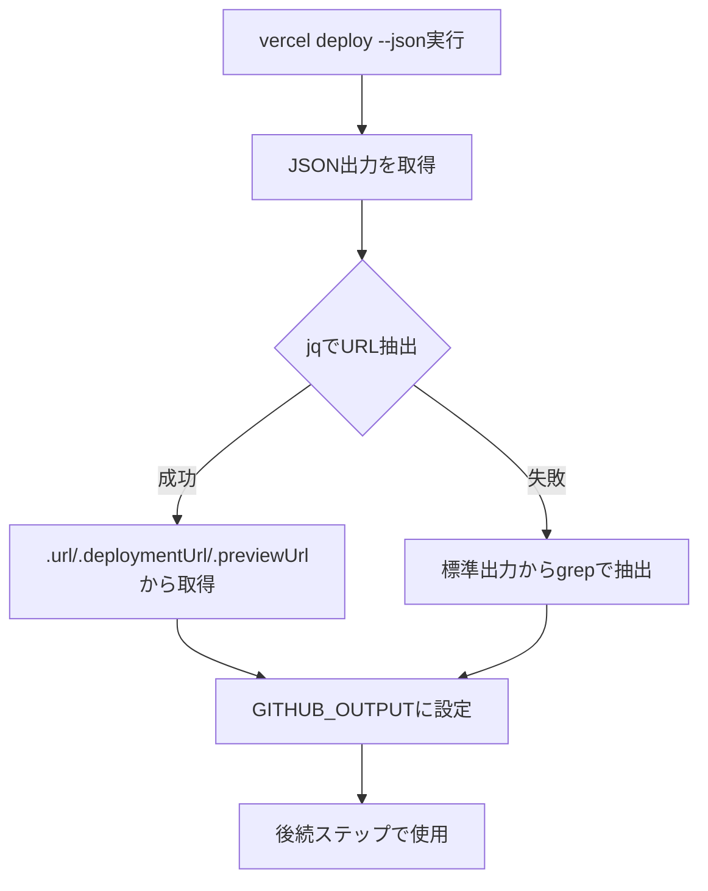

# Vercel Preview デプロイと連動した OWASP ZAP スキャンの自動化

## 概要

プルリクエスト（PR）作成時に Vercel プレビュー環境へデプロイし、その動的に生成されるプレビューURLに対してOWASP ZAPによる脆弱性スキャンを実行し、結果をPRにコメントとして自動投稿するGitHub Actionsワークフローを実装しました。これにより、コードがマージされる前にセキュリティ上の不備（XSS、インジェクション等）を検知できます。

## 変更内容

### CI/CD
- `.github/workflows/preview-security-scan.yml` を作成
- PR作成・更新時に自動実行されるワークフローを実装
- Vercel CLI を使用したプレビューデプロイプロセスの実装
  - `vercel pull`: 環境情報の同期
  - `vercel build`: プロジェクトのビルド
  - `vercel deploy --prebuilt`: ビルド済み成果物のプレビューデプロイ
- OWASP ZAP Baseline Scan の実行
- スキャン結果のPRコメントへの自動投稿
- 重大なセキュリティ問題検出時のワークフロー失敗

### コード品質改善
- Lintエラーの修正
  - `app/api/profile/route.ts`: 未使用の`Database`型インポートを削除
  - `app/api/scenarios/[id]/route.ts`: `any`型使用箇所に`eslint-disable-next-line`コメントを追加
  - `app/api/scenarios/route.ts`: `any`型使用箇所に`eslint-disable-next-line`コメントを追加
  - `app/components/ImageAnalyzer.tsx`: JSXコメントの形式を修正し、`any`型使用箇所に`eslint-disable-next-line`コメントを追加
  - `app/scenarios/[id]/page.tsx`: `any`型使用箇所に`eslint-disable-next-line`コメントを追加
- `npm run build`が正常に完了することを確認

## 処理フロー

### プレビューデプロイとセキュリティスキャンフロー

### ワークフローの詳細ステップ

### デプロイURL取得の詳細

## 技術的な詳細

### デプロイURLの取得方法

1. **JSON形式での取得（優先）**
   - `vercel deploy --json`でJSON出力を取得
   - `jq`を使用して`.url`、`.deploymentUrl`、`.previewUrl`の順に試行
   - `$GITHUB_OUTPUT`に`url`として設定

2. **フォールバック処理**
   - JSON形式で取得できない場合、標準出力から`grep`でURLを抽出
   - `https://*.vercel.app`のパターンで検索

3. **ステップ間でのデータ受け渡し**
   - `echo "url=$DEPLOYMENT_URL" >> $GITHUB_OUTPUT`で出力を設定
   - 後続ステップで`${{ steps.deploy.outputs.url }}`として参照

### OWASP ZAPスキャン

- **ツール**: `zaproxy/action-baseline@v0.12.0`
- **スキャンタイプ**: Baseline Scan（高速な基本スキャン）
- **出力形式**: HTML、JSON、Markdown、SARIF
- **ルールファイル**: `.zap/rules.tsv`（存在する場合）

### スキャン結果の処理

1. **結果の解析**
   - `zap_report.json`からリスクレベル別に問題をカウント
   - High Risk (riskcode: 3)
   - Medium Risk (riskcode: 2)
   - Low Risk (riskcode: 1)
   - Info (riskcode: 0)

2. **PRコメント投稿**
   - 詳細レポート（`zap_report.md`）を`comment-tag: zap-scan-results`で投稿
   - サマリーコメントを`comment-tag: zap-scan-summary`で投稿
   - `edit-mode: replace`により既存コメントを更新

3. **GitHub Securityへのアップロード**
   - SARIF形式でGitHub Securityにアップロード
   - Securityタブで結果を確認可能

4. **ワークフロー失敗**
   - High Risk Issuesが検出された場合、ワークフローを失敗
   - マージをブロックしてセキュリティ問題の混入を防止

## 必要な設定

### GitHub Secrets

以下の3つの値を GitHub の [Settings > Secrets and variables > Actions] に登録する必要があります：

- `VERCEL_TOKEN`: VercelのAccount Settingsで発行したAPIトークン
- `VERCEL_ORG_ID`: Vercel上のチームID
- `VERCEL_PROJECT_ID`: プロジェクトID

### GitHub Permissions

ワークフローには以下の権限が必要です：

- `contents: read`: コードのチェックアウト
- `pull-requests: write`: PRコメントの投稿
- `security-events: write`: GitHub SecurityへのSARIFアップロード
- `actions: read`: ワークフローの実行

## 期待される動作

1. PRを作成すると、数分後に Vercel のプレビューURLが発行される
2. 自動的に ZAP がそのURLを攻撃・スキャンし始める
3. スキャン結果がPRにコメントとして自動投稿される
4. セキュリティ上の重大な懸念がある場合、CIが失敗しマージを防ぐ

## 使用している技術

- GitHub Actions
- Vercel CLI
- OWASP ZAP (Baseline Scan)
- Node.js 24.11.1（package.jsonのvolta設定に合わせて指定）
- jq（JSON解析）
- peter-evans/create-or-update-comment（PRコメント投稿）

## 関連Issue

Closes #53

