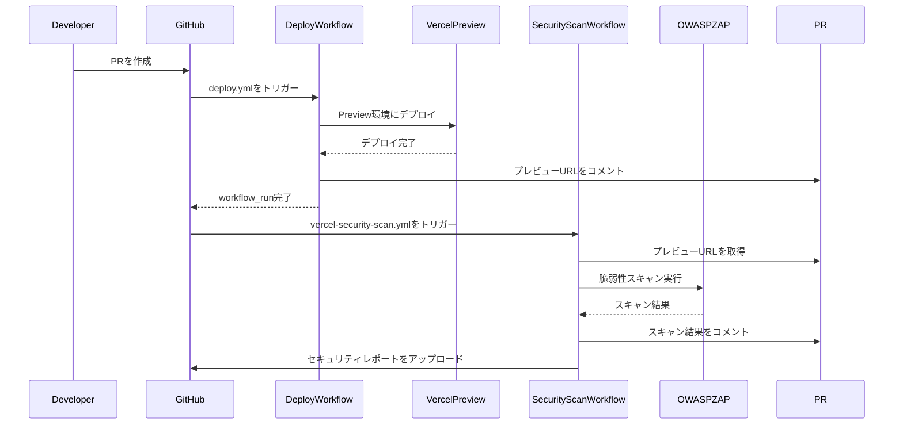
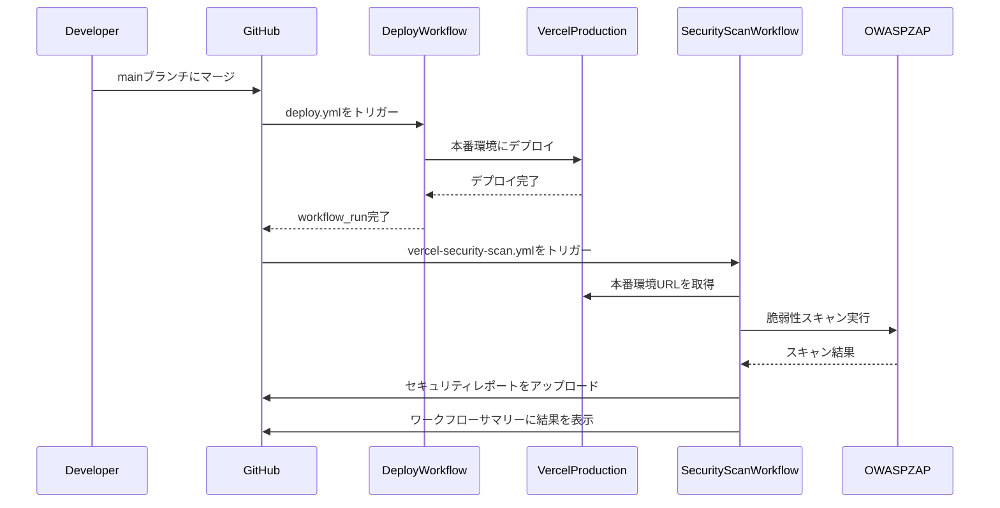

## 概要

GitHub Actionsのパイプラインを改善し、ワークフロー間の連携を適切に動作するように修正しました。

## 変更内容

- `cd.yml`を`docker-publish.yml`にリネーム（ワークフロー名も「Docker Publish」に更新）
- `preview-security-scan.yml`と`zap-scan.yml`を統合し、`vercel-security-scan.yml`として作成
- PR時とmainブランチpush時の両方に対応
- OWASP/ZAPスキャンがスキップされる問題を修正（`workflow_run`の条件を明確化）

## 処理フロー

### Pull Request作成時

### mainブランチマージ時

## 主な改善点

1. **ワークフロー名の明確化**
   - `cd.yml` → `docker-publish.yml`（より明確な名称に変更）

2. **ワークフローの統合**
   - `preview-security-scan.yml`と`zap-scan.yml`を統合し、重複を排除
   - PR時とmainブランチpush時の両方に対応する単一のワークフローに統合

3. **スキップ問題の修正**
   - `workflow_run`の条件を明確化し、PR時とmainブランチpush時の両方で確実に実行されるように修正
   - 条件式を簡潔にし、可読性を向上

4. **環境判定の改善**
   - PR時は自動的にプレビュー環境として判定
   - mainブランチpush時は本番環境として判定
   - `workflow_dispatch`時は手動で環境を指定可能

## テスト

- [ ] ESLintチェックを実行（問題なし）
- [ ] 脆弱性チェックを実行（high以上の脆弱性なし）
- [ ] ワークフローの構文を確認

## 関連Issue
Fixes #62

