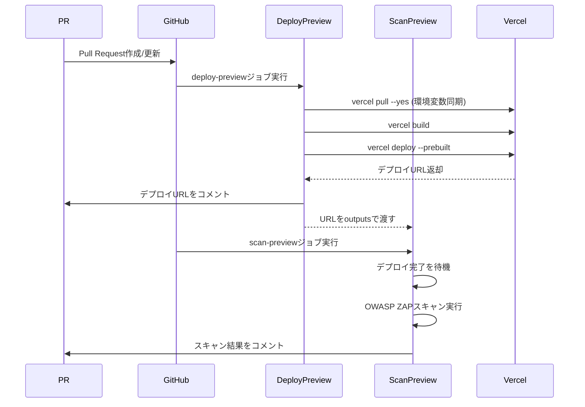
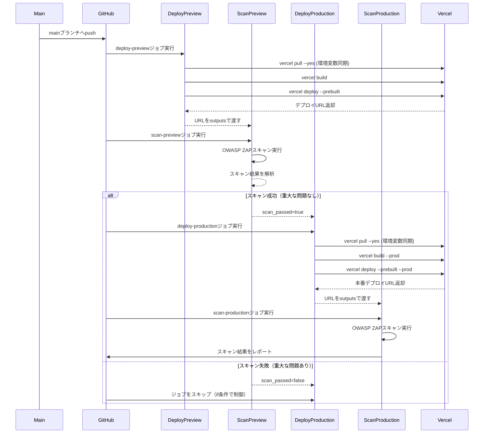

## 概要

現状の分割されたワークフロー（`deploy-preview.yml`、`deploy-production.yml`、`vercel-security-scan.yml`）を統合・再編し、セキュリティスキャン（OWASP ZAP）の結果をデプロイの成否判定（ゲート）として機能させる、堅牢なCI/CDパイプラインを構築しました。

## 変更内容

- **ワークフローの統合**: 3つのワークフローファイルを1つの`deploy-and-scan.yml`に統合
- **ジョブ間の依存関係**: `needs`を使用してジョブ間の依存関係を明確化
- **outputs連携**: Artifact経由ではなく、ジョブ間の`outputs`でURLとスキャン結果を連携
- **セキュリティゲート**: `scan-preview`の成功を`deploy-production`の実行条件として設定
- **Vercel環境変数同期**: 全デプロイジョブで`vercel pull --yes`を実行して環境変数を同期
- **動的URLのキャプチャ**: `vercel deploy`の標準出力からURLを抽出して後続ジョブに渡す

## 処理フロー

### Pull Request作成/更新時

### mainブランチへのマージ（Push）時

## 主な改善点

### 1. ワークフローの依存関係と制御

- 全てのジョブを`needs`で繋ぎ、順次実行を保証
- `deploy-production`には以下の条件を付与：
  - `github.event_name == 'push' && github.ref == 'refs/heads/main'`
  - `needs.deploy-preview.result == 'success'`
  - `needs.scan-preview.result == 'success'`
  - `needs.scan-preview.outputs.scan_passed == 'true'`

### 2. Vercel環境変数の同期

- 各デプロイ・ビルドジョブの開始前に`vercel pull --yes`を実行
- `VERCEL_ORG_ID`および`VERCEL_PROJECT_ID`をGitHub Secretsから取得して使用

### 3. 動的URLのキャプチャとZAP実行

- `vercel deploy`の標準出力をキャプチャし、`https://*.vercel.app`形式のURLを抽出
- 抽出したURLを`outputs`として後続ジョブに渡す
- Artifact経由ではなく、ジョブ間の`outputs`連携に切り替え

### 4. セキュリティゲートの実装

- `scan-preview`ジョブで`outputs.scan_passed`を設定
- 重大な問題（High Risk Issues）が検出された場合、`scan_passed=false`を設定
- `deploy-production`は`scan_passed == 'true'`の場合のみ実行

## テスト

- [x] ワークフローの構文チェック
- [x] ジョブ間の依存関係の確認
- [x] outputs連携の確認
- [x] 条件分岐の確認

## 関連Issue

Closes #64

