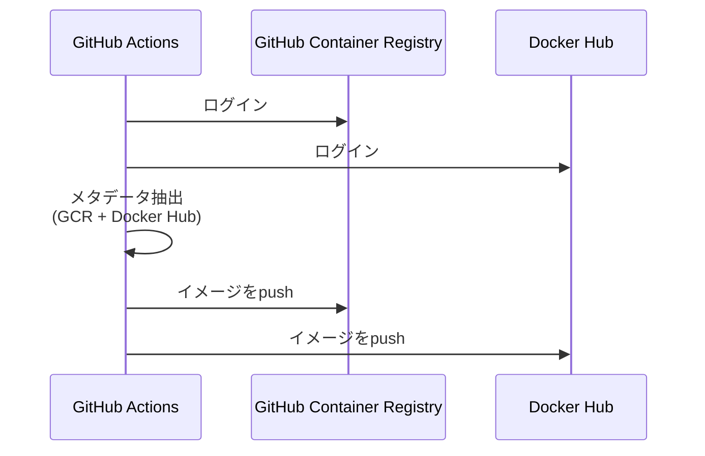

## 概要
GitHub Container Registryへのイメージpushに加えて、Docker Hubへのイメージpushも追加しました。

## 変更内容
- Docker Hubへのログインステップを追加（`secrets.DOCKERHUB_USERNAME`と`secrets.DOCKERHUB_TOKEN`を使用）
- メタデータ抽出でDocker Hubのイメージタグも生成するように変更
- GitHub Container RegistryとDocker Hubの両方に同じイメージをpushするように変更

## 処理フロー

## テスト
- [x] ワークフローファイルの構文チェック
- [x] ESLintチェック
- [x] 脆弱性チェック（重大な脆弱性なし）

## 関連Issue
Closes #77

