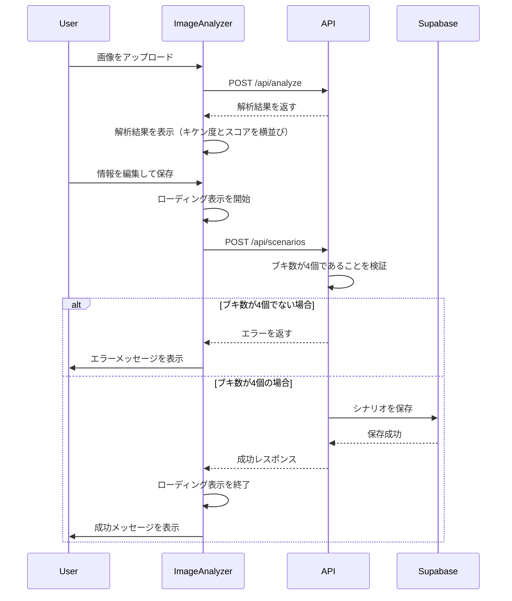

## 概要
Analyze画面の挙動を修正しました。ブキ数の検証処理を4個固定のチェックに変更し、キケン度とスコアの表示レイアウトを調整し、保存処理中のローディング表示を追加しました。

## 変更内容
- **ブキ数の検証処理を4個固定のチェックに修正**
  - AIの解析結果のブキ数と画面から入力したブキ数の一致検証を削除
  - ブキ数は常に4個固定であることを確認する検証に変更
  - `app/api/scenarios/route.ts`の武器ID取得処理を修正

- **キケン度とスコアの表示レイアウトを調整**
  - スマホで表示した際にキケン度の表示領域（横幅）が狭すぎて、項目説明の「キケン度」という文字列や、入力した数値が切れる問題を修正
  - キケン度の幅を`xs: 7`、スコアの幅を`xs: 5`に変更（PCでは`md: 6`のまま）
  - `app/components/ImageAnalyzer.tsx`のGridレイアウトを調整

- **保存処理中のローディング表示を追加**
  - 保存処理が長い場合に、処理中であることを明確に示すローディング表示を追加
  - フォーム全体をオーバーレイで覆い、CircularProgressとメッセージを表示
  - `app/components/ImageAnalyzer.tsx`に保存中のローディング表示を追加

- **テストを追加**
  - ブキ数の検証処理のテストを追加
  - `app/api/__tests__/scenarios.test.ts`にPOSTメソッドのテストを追加

## 処理フロー

## テスト
- [x] ブキ数が4個でない場合のエラーハンドリングのテストを追加
- [x] ブキ数が4個の場合の正常系のテストを追加
- [x] weapon_idsの数が4個でない場合のエラーハンドリングのテストを追加
- [x] ESLintチェックを実行（エラーなし）
- [x] 脆弱性チェックを実行（開発依存関係のみ、本番環境には影響なし）

## 関連Issue
Closes #82

