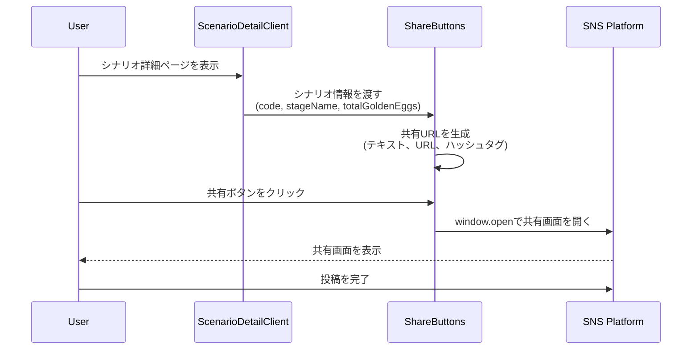

## 概要
ユーザーが気に入ったシナリオを、𝕏、BlueSky、LINEで簡単にシェアできる機能を実装しました。

## 変更内容
- `app/components/scenario/ShareButtons.tsx`を新規作成
  - 𝕏、BlueSky、LINEの3つの共有ボタンを実装
  - 各SNSのインテントURLを動的に生成
  - 投稿内容にステージ名、金イクラ数、シナリオコードを自動で含める
  - ハッシュタグを自動付与（#サーモンランNW #SalmonRunScenarioHub #サーモンランシナリオhub）
- `app/scenarios/[id]/ScenarioDetailClient.tsx`に統合
  - シナリオコード表示セクションの直下に共有ボタンを配置
- `app/components/scenario/__tests__/ShareButtons.test.tsx`を追加
  - 各SNSボタンのクリック時の動作をテスト
  - URL生成の正確性を検証

## 処理フロー

## 各SNSの共有URL仕様

### 𝕏 (Twitter)
- URL: `https://x.com/intent/post?text={TEXT}&url={URL}&hashtags={HASHTAGS}`
- テキスト: 「ステージ: {StageName} / 金イクラ: {TotalEggs} / シナリオコード: {ScenarioCode}」
- ハッシュタグ: `サーモンランNW,SalmonRunScenarioHub,サーモンランシナリオhub`

### BlueSky
- URL: `https://bsky.app/intent/compose?text={TEXT}%20{URL}`
- テキスト: 「ステージ: {StageName} / 金イクラ: {TotalEggs} / シナリオコード: {ScenarioCode} {URL}」

### LINE
- URL: `https://social-plugins.line.me/lineit/share?url={URL}`
- シナリオ詳細ページのURLを共有

## テスト
- [x] 各SNSボタンが正しく表示されることを確認
- [x] 各SNSボタンクリック時に正しいURLが生成されることを確認
- [x] 投稿内容にステージ名、金イクラ数、シナリオコードが含まれることを確認
- [x] ハッシュタグが正しく付与されることを確認

## 関連Issue
Closes #85

