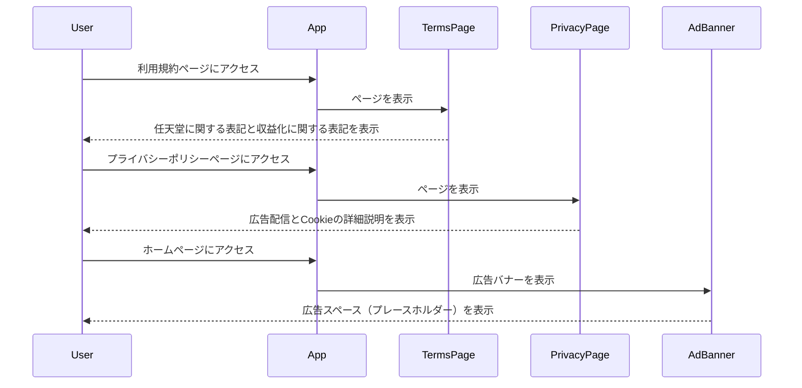

## 概要

マイルストーン10「法的免責事項に関するガイドライン強化」に対応し、以下の4つのIssueを全て実装しました。

- Issue #58: 任天堂ガイドラインに準拠した免責事項と収益化に関する表記の追加
- Issue #59: 公式ロゴ・商標を避けた独自デザインへの修正
- Issue #60: プライバシーポリシー（広告配信・Cookie）の追加
- Issue #61: 広告配置用コンポーネントの作成とレイアウト調整

## 変更内容

### Issue #58: 任天堂ガイドラインに準拠した免責事項と収益化に関する表記の追加

- 利用規約に「5. 任天堂に関する表記」セクションを追加
  - 本サービスが任天堂の公式サービスではないことを明記
  - 任天堂のファンコンテンツガイドラインに準拠していることを明記
  - 商標・著作権に関する表記を追加
- 利用規約に「6. 収益化に関する表記」セクションを追加
  - 広告配信等による収益化について説明
  - プライバシーポリシーへのリンクを追加

### Issue #59: 公式ロゴ・商標を避けた独自デザインへの修正

- `LogoIcon`コンポーネントにコメントを追加
  - ロゴが任天堂の公式ロゴや商標とは一切関係のない独自デザインであることを明記
  - 任天堂のファンコンテンツガイドラインに準拠していることを明記

### Issue #60: プライバシーポリシー（広告配信・Cookie）の追加

- プライバシーポリシーに「6. 広告配信について」セクションを追加
  - 第三者広告配信事業者による広告配信について説明
  - 広告配信事業者がCookieを使用することを明記
  - オプトアウト方法について説明
- プライバシーポリシーの「7. Cookieの使用」セクションを詳細化
  - Cookieの使用目的を明確化
  - Cookieの種類（必須Cookie、分析Cookie、広告Cookie）を説明
  - Cookieの制限方法について説明

### Issue #61: 広告配置用コンポーネントの作成とレイアウト調整

- `AdBanner`コンポーネントを新規作成
  - レスポンシブ、中長方形、バナー、縦長の4つのサイズに対応
  - 広告配信サービス（Google AdSenseなど）との統合を想定した設計
  - プレースホルダー表示機能を実装
- ホームページに広告配置スペースを追加
  - ヒーローセクションの下にバナー広告を配置
  - 最新シナリオセクションの前にレスポンシブ広告を配置
- レイアウトに広告配置スペースを追加
  - フッターの上にバナー広告を配置（全ページ共通）

## 処理フロー

## テスト

- [x] 利用規約ページのテストを更新（新規セクションに対応）
- [x] プライバシーポリシーページのテストを更新（新規セクションに対応）
- [x] `AdBanner`コンポーネントのテストを追加
- [x] 全てのテストが正常に通過することを確認

## 関連Issue

Closes #58
Closes #59
Closes #60
Closes #61

