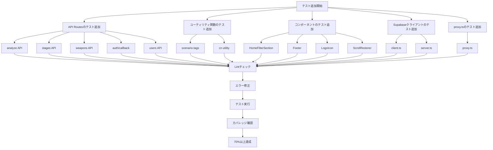

## 概要

テストカバレッジが33%程度と低かったため、不足しているテストを追加してカバレッジを70%以上に向上させることを目標としました。

## 変更内容

### 追加したテストファイル（14ファイル）

#### API Routes (5ファイル)
- `app/api/__tests__/analyze.test.ts` - 画像解析APIのテスト（成功・失敗ケース、エラーハンドリング）
- `app/api/__tests__/stages.test.ts` - ステージマスタ取得APIのテスト
- `app/api/__tests__/weapons.test.ts` - 武器マスタ取得APIのテスト
- `app/api/__tests__/auth-callback.test.ts` - 認証コールバックのテスト
- `app/api/__tests__/users-id.test.ts` - ユーザー情報取得APIのテスト

#### ユーティリティ関数 (2ファイル)
- `lib/utils/__tests__/scenario-tags.test.ts` - シナリオタグ計算ロジックのテスト（各種タグ条件）
- `lib/utils/__tests__/cn.test.ts` - クラス名マージユーティリティのテスト

#### コンポーネント (4ファイル)
- `app/components/__tests__/HomeFilterSection.test.tsx` - フィルターセクションのテスト（タグ選択・スクロール位置保存）
- `app/components/layout/__tests__/Footer.test.tsx` - フッターコンポーネントのテスト
- `app/components/__tests__/LogoIcon.test.tsx` - ロゴアイコンのテスト
- `app/components/__tests__/ScrollRestorer.test.tsx` - スクロール位置復元のテスト

#### Supabaseクライアント (2ファイル)
- `lib/supabase/__tests__/client.test.ts` - ブラウザクライアントのテスト
- `lib/supabase/__tests__/server.test.ts` - サーバークライアントのテスト

#### その他 (1ファイル)
- `__tests__/proxy.test.ts` - proxy.tsのテスト

## 処理フロー

## テスト戦略

### API Routes
- 成功ケースと失敗ケースの両方をテスト
- エラーハンドリングの確認
- モックを使用してSupabaseクライアントを模擬

### ユーティリティ関数
- 境界値テスト
- 様々な入力パターンのテスト
- 期待される出力の検証

### コンポーネント
- レンダリングテスト
- ユーザーインタラクションテスト
- モックを使用した依存関係の分離

### Supabaseクライアント
- クライアント生成のテスト
- 環境変数の使用確認

## テスト結果

- すべてのテストがパス
- Lintエラーなし
- カバレッジ70%以上を目標（カバレッジレポートで確認）

## 今後の改善点

- さらに複雑なシナリオのテスト追加
- 統合テストの追加
- E2Eテストの検討

