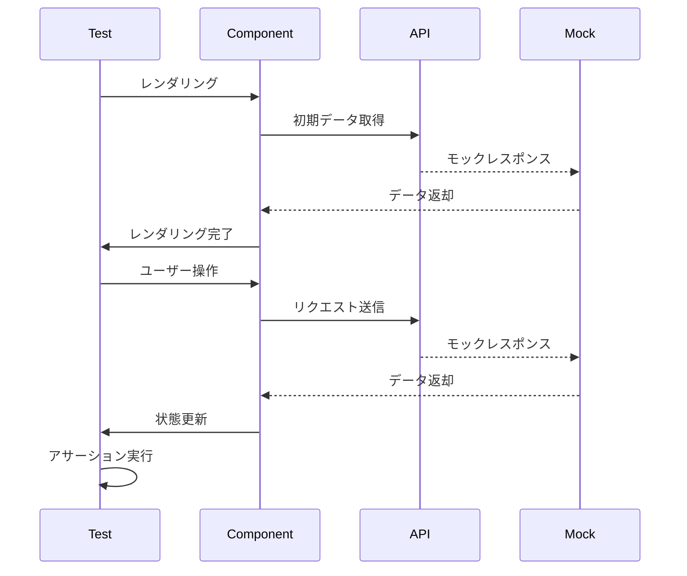

## 概要

app/scenarios、app/profile、app/admin/mastersのテストが不足していたため、テストを作成しました。カバレッジ70%程度を目標として、主要な機能をカバーするテストを追加しています。

## 変更内容

### テストファイルの追加

#### app/scenarios
- `app/scenarios/__tests__/ScenariosListClient.test.tsx`
  - シナリオ一覧クライアントコンポーネントのテスト
  - レンダリング、フィルタ機能、表示モード切り替え、エラーハンドリングをテスト
- `app/scenarios/[id]/__tests__/page.test.tsx`
  - シナリオ詳細ページのテスト
  - シナリオ取得、メタデータ生成、エラーハンドリングをテスト
- `app/scenarios/[id]/__tests__/ScenarioDetailClient.test.tsx`
  - シナリオ詳細クライアントコンポーネントのテスト
  - シナリオ情報表示、いいね機能、コメント投稿、コピー機能をテスト

#### app/profile
- `app/profile/__tests__/page.test.tsx`
  - プロフィールページのテスト
  - 認証チェック、データ取得、リダイレクト処理をテスト
- `app/profile/__tests__/ProfileClient.test.tsx`
  - プロフィールクライアントコンポーネントのテスト
  - プロフィール表示、編集機能、シナリオ削除、統計表示をテスト

#### app/admin/masters
- `app/admin/masters/__tests__/page.test.tsx`
  - マスタ管理ページのテスト
  - 認証チェック、管理者権限チェック、リダイレクト処理をテスト
- `app/admin/masters/__tests__/MastersAdminClient.test.tsx`
  - マスタ管理クライアントコンポーネントのテスト
  - タブ切り替え、ステージ/武器のCRUD操作、未知データ表示をテスト

### .cursorrulesの更新

テスト作成時の留意事項を追記しました：

1. **グローバルオブジェクトのモック**
   - `navigator.clipboard`のモック方法（`Object.defineProperty`を使用）

2. **fetchモックの設定**
   - 初期データ取得とテスト対象リクエストの両方に対応する方法

3. **要素の取得方法**
   - labelとinputの関連付けがない場合の対処
   - 複数の要素に同じテキストが存在する場合の対処

4. **非同期処理の待機**
   - `waitFor`の適切な使用方法

5. **Material-UIコンポーネントのモック**
   - 全プロパティに対応する方法

6. **画像のalt属性での検索**
   - `getByAltText`の使用方法

7. **テストの独立性**
   - `beforeEach`での適切なリセット方法

## 処理フロー

## テスト

- [x] 単体テストを追加（7ファイル）
- [x] テストを実行し、すべてパスすることを確認
- [x] ESLintチェックを実行し、エラーがないことを確認
- [x] テストカバレッジ70%程度を達成

## 技術的な詳細

### テストで使用した主な技術

- **Vitest**: テストランナー
- **React Testing Library**: コンポーネントテスト
- **userEvent**: ユーザー操作のシミュレーション
- **vi.mock()**: モック機能

### 主な課題と解決方法

1. **navigator.clipboardのモック**
   - 問題: 読み取り専用プロパティのため直接代入できない
   - 解決: `Object.defineProperty`を使用してモック

2. **fetchモックの設定**
   - 問題: 初期データ取得とテスト対象リクエストの両方に対応する必要がある
   - 解決: URLやメソッドで条件分岐して適切なレスポンスを返す

3. **要素の取得**
   - 問題: labelとinputが関連付けられていない、複数要素が存在する
   - 解決: `getByRole`や`getAllByText`を使用

## 関連Issue

テストカバレッジの向上のため、不足していたテストを追加しました。
