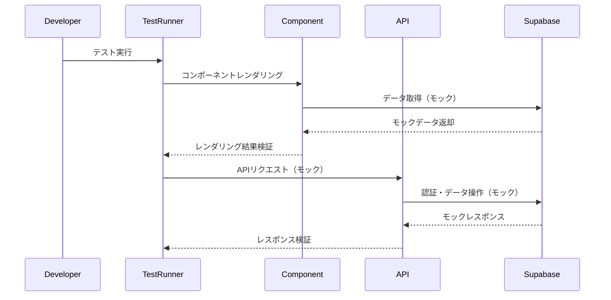

## 概要
appディレクトリ内のテストカバレッジを向上させるため、不足していたテストファイルを追加しました。目標カバレッジ70%を目指して、主要なページコンポーネント、APIルート、クライアントコンポーネントのテストを拡充しました。

## 変更内容
- **ページコンポーネントのテスト追加**
  - `app/layout.tsx` - ルートレイアウトのテスト
  - `app/auth/login/page.tsx` - ログインページのテスト
  - `app/analyze/page.tsx` - 解析ページのテスト
  - `app/privacy/page.tsx` - プライバシーページのテスト
  - `app/terms/page.tsx` - 利用規約ページのテスト
  - `app/scenarios/page.tsx` - シナリオ一覧ページのテスト

- **コンポーネントのテスト追加**
  - `app/components/providers/ThemeProvider.tsx` - テーマプロバイダーのテスト

- **APIルートのテスト追加**
  - `app/api/scenarios/[id]/comments/route.ts` - コメントAPIのテスト（GET, POST）
  - `app/api/scenarios/[id]/likes/route.ts` - いいねAPIのテスト（POST）
  - `app/api/profile/avatar/route.ts` - アバターアップロードAPIのテスト（POST）
  - `app/api/admin/unknown/route.ts` - 未知データAPIのテスト（GET）

- **テスト修正**
  - `app/api/profile/avatar/__tests__/route.test.ts` - FormDataのモック処理を修正

## 処理フロー

## テスト
- [x] 単体テストを追加（11ファイル、1391行）
- [x] ESLintチェックを実行（エラーなし）
- [x] 既存テストがすべてパスすることを確認
- [x] 新規追加テストがすべてパスすることを確認

## テストカバレッジ
- ページコンポーネント: 主要ページのテストを追加
- APIルート: 不足していたAPIエンドポイントのテストを追加
- コンポーネント: 基本的なコンポーネントのテストを追加

## 技術的な詳細
- VitestとReact Testing Libraryを使用
- Next.jsの`request.formData()`を適切にモック
- Supabaseクライアントをモックしてテストの独立性を確保
- エラーハンドリングとエッジケースをカバー
