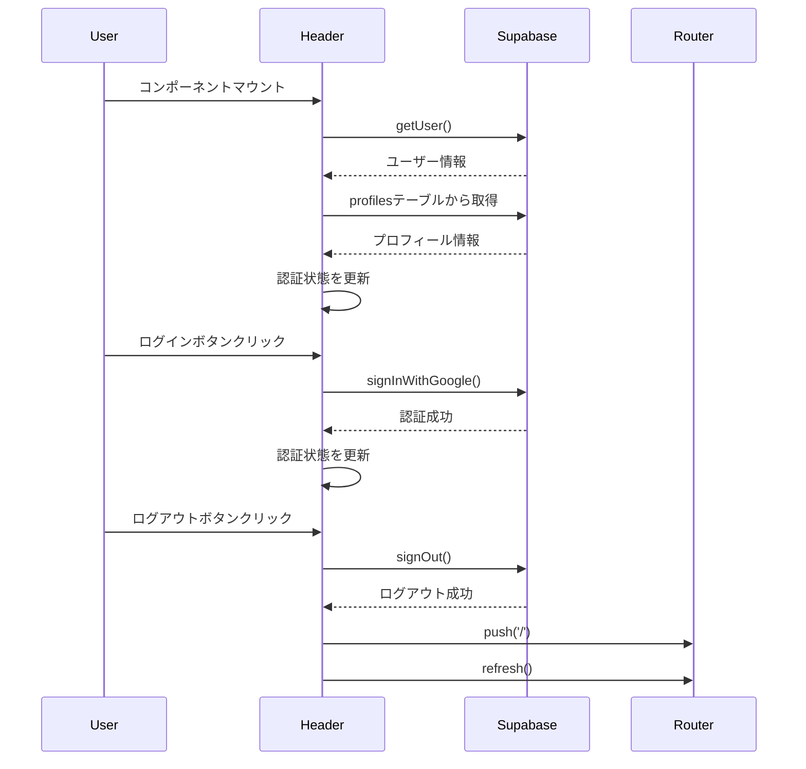
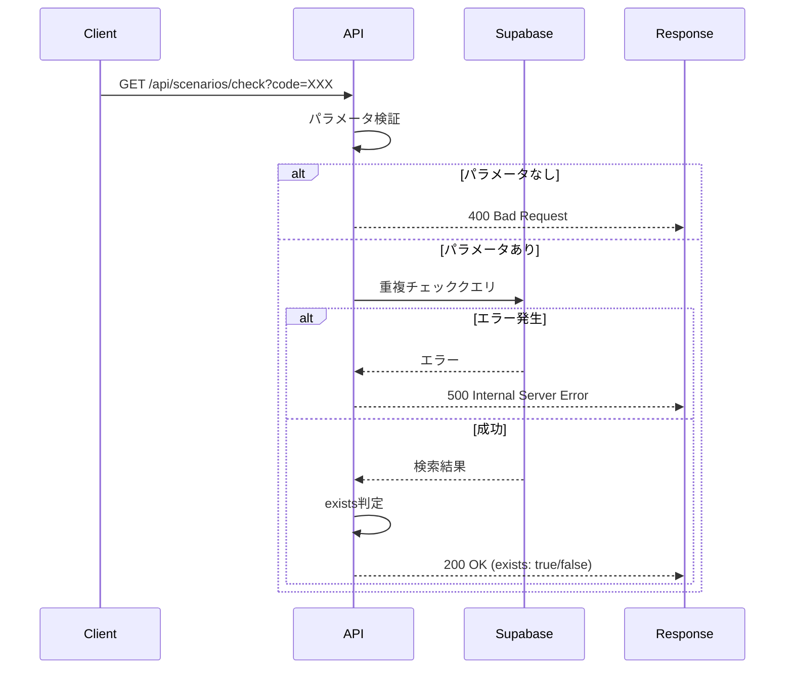

## 概要

既存のテストファイルを拡充し、テストカバレッジと品質を向上させました。Header.tsx、api/scenarios/check/route.ts、lib/supabase/server.ts、lib/utils/scenario-tags.tsのテストを大幅に拡充しています。

## 変更内容

### テストファイルの拡充

#### app/components/layout/__tests__/Header.test.tsx
- **認証状態のテスト**: ローディング状態、ログイン/ログアウト、認証状態変更のテストを追加
- **プロフィール画像のテスト**: profilesテーブルからの取得、user_metadataからのフォールバック、エラーハンドリングのテストを追加
- **ログイン/ログアウト機能のテスト**: 成功ケースとエラーケースの両方をテスト
- **ナビゲーションのテスト**: アクティブパスのハイライト機能をテスト
- **モバイルメニューのテスト**: メニューの開閉、リンククリック時の動作をテスト
- **クリーンアップのテスト**: コンポーネントのアンマウント時のunsubscribe処理をテスト
- **エラーハンドリングのテスト**: getUserエラー、プロフィール取得エラーの処理をテスト

#### app/api/__tests__/scenarios-check.test.ts
- **正常系のテスト**: シナリオコードの存在確認、空文字列・空白のみのケースを追加
- **エラーハンドリングのテスト**: Supabaseクエリエラー、予期しないエラーの処理をテスト
- **クエリパラメータのテスト**: URLエンコード、複数パラメータの処理をテスト
- **レスポンス形式のテスト**: 成功時・エラー時のレスポンス構造を検証
- **Supabaseクエリチェーンのテスト**: 正しい順序でメソッドが呼ばれることを確認

#### lib/supabase/__tests__/server.test.ts
- **Cookie処理のテスト**: getAll、setAllの動作、エラーハンドリングをテスト
- **環境変数のテスト**: 環境変数の存在/不存在のケースをテスト
- **非同期処理のテスト**: cookies()の非同期処理を適切に待機することを確認
- **型安全性のテスト**: Database型が正しく渡されることを確認
- **エラーハンドリングのテスト**: Cookieストアエラー、createServerClientエラーの処理をテスト

#### lib/utils/__tests__/scenario-tags.test.ts
- **エッジケースのテスト**: 空配列、境界値、部分的な条件のテストを追加
  - 空のweapons配列、空のwaves配列
  - danger_rateの境界値（160、159）
  - total_golden_eggsの境界値（200、201）
  - 高難易度タグの条件（333%かつ未クリア）
  - オカシライベントの除外処理
- **組み合わせテスト**: 複数タグが同時に付与されるケースをテスト
- **タグカラーのテスト**: 各タグのカラーが正しく設定されることを確認

## 処理フロー

### Headerコンポーネントの認証フロー



### シナリオコードチェックAPIのフロー



### Supabaseサーバークライアント作成フロー

```mermaid
sequenceDiagram
    participant App
    participant createClient
    participant cookies()
    participant createServerClient
    
    App->>createClient: createClient()
    createClient->>cookies(): await cookies()
    cookies()-->>createClient: cookieStore
    createClient->>createServerClient: createServerClient(url, key, options)
    Note over createServerClient: cookies: { getAll, setAll }
    createServerClient-->>createClient: SupabaseClient
    createClient-->>App: SupabaseClient
```

## テスト

- [x] 単体テストを拡充（4ファイル）
- [x] テストを実行し、すべてパスすることを確認
- [x] ESLintチェックを実行し、エラーがないことを確認
- [x] エッジケースとエラーハンドリングをカバー

## 技術的な詳細

### 追加したテストの特徴

1. **包括的なエラーハンドリングテスト**
   - 各コンポーネント/関数で発生しうるエラーケースを網羅
   - エラー発生時の適切な処理を検証

2. **エッジケースの網羅**
   - 空配列、境界値、部分的な条件など
   - 実際の使用で発生しうる特殊なケースをテスト

3. **非同期処理の適切なテスト**
   - `waitFor`を使用した非同期処理の待機
   - 認証状態変更などのイベント駆動の処理をテスト

4. **モックの適切な使用**
   - Supabaseクライアント、Next.jsのナビゲーションフックなどを適切にモック
   - テストの独立性を保つための適切なリセット処理

### 主な改善点

1. **Header.tsxのテスト**
   - 認証状態の変更を適切にシミュレート
   - プロフィール画像の取得とフォールバック処理をテスト
   - モバイルメニューの動作を詳細にテスト

2. **scenarios-check APIのテスト**
   - エラーハンドリングを強化
   - クエリパラメータの様々なケースをテスト
   - Supabaseクエリチェーンの動作を検証

3. **server.tsのテスト**
   - Cookie処理の詳細なテスト
   - 環境変数の扱いをテスト
   - エラーケースの処理を確認

4. **scenario-tags.tsのテスト**
   - エッジケースを網羅的にテスト
   - 複数タグの組み合わせをテスト
   - タグカラーの設定を検証

## 関連Issue

テストカバレッジの向上と品質改善のため、既存テストを拡充しました。

